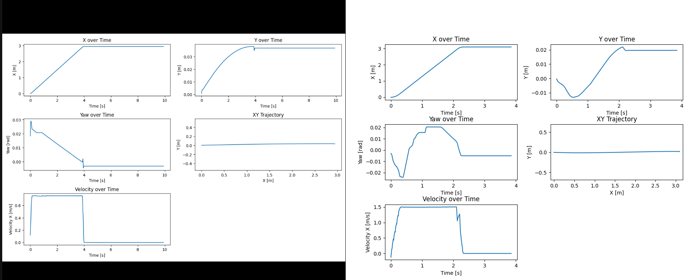
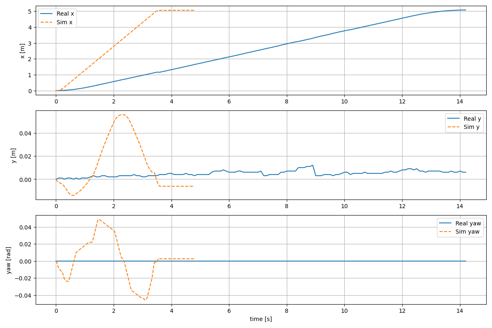
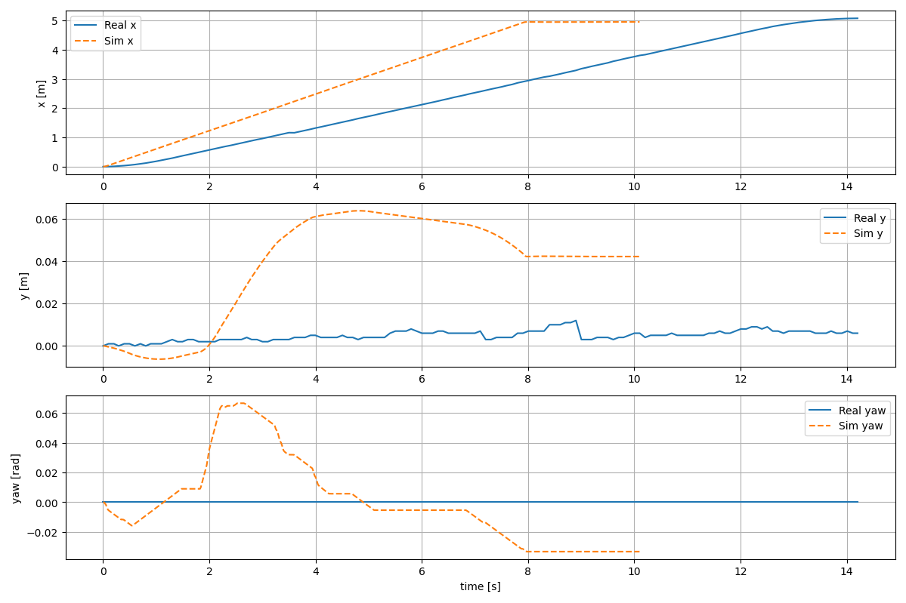

# Steps for Converting Data, Preprocessing, and Running `compute_kpis.py`

## Step 1: **Converting Simulated Data (rosbag) to CSV**

1. **Command used**:
   - Convert the ROS bag file to CSV using extract_rosbagdata.py file and then preprocess the data using preprocess.py. 
   
2. **Preprocessing the data**:
   - **Trimming**: Using velocity (`vx > 0.02 m/s`) and goal proximity (goal reached when `x, y` within 0.05 m of target).
   - **Zeroing**: Subtract the first timestamp (`t0`) to start at **`t=0`** for both sim and real data.
   - ```python preprocess.py```

3. Plotting 
   - Plot using python plot.py script to visualize the plot
---

## Step 2: **Recording Real Robot Data Using MQTT**

1. **Setup**:
   - MQTT client connects to the robot at `HOST = 192.168.18.3` on port `8883` using TLS for security.

2. **Data Logging**:
   - Subscribe to pose and status topics: `itk/dt/robot/pose` and `itk/dt/robot/status`.
   - Log data only when `status="Driving"` (motion is active).
   - ```python mqtt.py```

3. **Data Format**:
   - Log format: `t, x, y, yaw` (where `t` is in seconds, `x, y` in meters, and `yaw` in radians).

4. **MQTT Data Handling**:
   - When a status update is received, check if the robot is moving (`status=="Driving"`).
   - On receiving pose data (`/pose` topic), write the `t,x,y,yaw` values to a CSV file.

---

## Step 3: **Running `compute_kpis.py`**

1. **Input**:  
   - **Real and Sim CSVs**: Both datasets are in the format of `t,x,y,yaw`.

2. **Preprocessing before KPIs**:
   - Normalize both datasets to the same start pose and initial yaw. This aligns both real and simulated data in the same coordinate frame (zeroed at the start position, initial yaw set to 0).

3. **Key Functionality**:
   - **Resampling**: The script resamples both the real and sim data to **10 Hz** based on the overlapping time range.
   - **KPIs Computation**: Computes **RMSE_pos**, **RMSE_psi**, and **J_tilde**:
     - **RMSE_pos**: Position error between real and sim.
     - **RMSE_psi**: Yaw error.
     - **J_tilde**: Normalized combined error score.

4. **Running the script**:
   - Example command:
     ```bash
     python compute_kpis.py --real real_log_for_kpi.csv --sim sim_log_for_kpi.csv
     ```

---

## Step 4: **Running the Entire Process**

1. **Data Logging (Real Robot)**:
   - Run the MQTT script that logs real robot data and outputs to `real_log_for_kpi.csv`.

2. **Simulated Data Conversion**:
   - Convert simulated rosbag data to `sim_log_for_kpi.csv`.

3. **Run `compute_kpis.py`**:
   - Use the following command to compute the KPIs:
     ```bash
     python compute_kpis.py --real real_log_for_kpi.csv --sim sim_log_for_kpi.csv
     ```

4. **Output**:
   - Prints RMSE values for position (`RMSE_pos`), yaw (`RMSE_psi`), and combined error (`J_tilde`).


# Finding: Adjusting Tolerances Based on Omron LD250 Datasheet

## Problem:
When comparing the real robot data with the simulated data, **J_tilde** was high due to the large position error (1.08 m) in the real robot's movement. This was after setting the default thresholds for position and yaw based on initial assumptions.

## Approach:
1. **Original Thresholds**:
   - **Position Tolerance (`T_pos`)**: 0.03 m (3 cm)
   - **Yaw Tolerance (`T_psi`)**: 0.02 rad (~1.15°)

2. **Omron LD250 Datasheet Thresholds**:
   - **Position Tolerance (`T_pos`)**: 0.1 m (100 mm)
   - **Yaw Tolerance (`T_psi`)**: 0.0349 rad (2°)

## Results:

### **Before Adjusting to LD250 Thresholds**:
```bash
RMSE_pos  [m]  = 1.08025
RMSE_psi  [rad] = 0.02637  [deg] = 1.51065
J_tilde         = 18.66327
```

### **After Adjusting to LD250 Thresholds**:
```
RMSE_pos  [m]  = 1.08025
RMSE_psi  [rad] = 0.02637  [deg] = 1.51065
J_tilde         = 5.77897
```

J_tilde = 5.77897 shows a significant reduction in J_tilde after increasing the position threshold to 0.1 m and yaw to 2°, as per the Omron LD250 datasheet.


### KPI Evaluation Results of pilot iteration 

| Metric | Description | Value | Interpretation |
|---------|--------------|--------|----------------|
| **Overlap** | Common time window between real and simulated trajectories | 0.00 – 9.90 s | 10 s of overlapping data used for comparison |
| **Sim Δx, Δy [m]** | Net displacement of simulated robot in X/Y | 2.937, −0.018 | Sim robot moved ~3 m forward |
| **Real Δx, Δy [m]** | Net displacement of real robot in X/Y | 0.921, −0.012 | Real robot moved ~1 m forward |
| **Samples** | Number of synchronized samples at ~10 Hz | 100 | Sufficient data for KPI computation |
| **RMSE_pos [m]** | Root Mean Square Error of position | **2.018** | Large spatial deviation between sim and real |
| **RMSE_psi [rad] / [deg]** | Root Mean Square Error of yaw | **0.0175 rad (≈ 1.0°)** | Good heading agreement |
| **J_tilde** | Combined normalized KPI (≤ 1.0 = pass) | **10.34** | Fails threshold — significant sim-to-real gap in position |

**Summary:**  
Simulation shows similar heading but moves ~3× farther than the real robot, leading to a high position RMSE and large `J_tilde`.  
Further tuning of simulated robot dynamics or control parameters is required to reduce the sim-to-real gap.


## 🧠 Finding: Effect of Differential Controller Caps on Simulated AGV Dynamics

### 🎯 Purpose
To investigate the impact of **Isaac Sim's Differential Controller Node** caps on robot stability and control, particularly in relation to wheel joint damping and velocity control.

### ⚙️ Setup & Iterations
1. **Initial Setup (With Caps)**
   - `maxLinearSpeed`: 1.2 m/s
   - `maxAngularSpeed`: 1.047 rad/s
   - Wheel joint damping: default values
   - Result: Stable motion with predictable behavior

2. **Removed Caps**
   - All cap values set to `0`
   - Initial wheel joint damping: 1e-9
   - Result: Loss of control, particularly in angular motion

3. **Damping Adjustment Attempts**
   - Tested damping range: 1e-9 to 1e-4
   - Result: Persistent control issues:
     - Poor angular control
     - Delayed stopping response
     - Robot continued moving even without velocity commands

4. **Final Configuration (Restored Caps)**
   - Restored original cap values
   - Result: Regained stability and control

### 📊 Key Observations
| Configuration | Behavior | Control Response | Stability |
|--------------|----------|------------------|-----------|
| **With Caps** | Predictable motion | Immediate stop response | High stability |
| **No Caps** | Erratic movement | Delayed stopping | Poor stability |
| **No Caps + Adjusted Damping** | Improved but still unstable | Inconsistent response | Medium-low stability |


The below image shows the inital (first iteration) effect of removing and adding cap values



### ⚠️ Critical Findings
1. **Cap Values are Essential:**
   - Despite being optional parameters, caps play a crucial role in maintaining simulation stability
   - They provide an additional layer of control that complements ROS 2 controllers

2. **Damping Sensitivity:**
   - Robot's behavior is highly sensitive to wheel joint damping values
   - Removing caps exposed underlying stability issues that damping adjustments couldn't fully resolve

3. **Control Hierarchy:**
   - Isaac Sim's caps provide a fundamental control envelope
   - ROS 2 controllers work best within this envelope rather than as the sole control mechanism

### ✅ Conclusion
> **Cap values in Isaac Sim's Differential Controller Node should be maintained** for optimal stability and control.
> While theoretically optional, they provide essential boundaries for realistic robot behavior and stable simulation.

### 🔍 Technical Implications
- Keep caps matched to real robot specifications (1.2 m/s, 1.047 rad/s)
- Consider caps as part of the core simulation configuration
- Use ROS 2 controllers for fine-tuning within these boundaries
- Monitor joint damping values but prioritize cap settings for stability

### 🛠️ Best Practices
1. Start with manufacturer-specified cap values
2. Maintain caps even when using ROS 2 controllers
3. Use ROS 2 controllers for trajectory refinement
4. Consider caps as safety limits rather than optional parameters


# Sim2Real Alignment Process

## Overview

This document describes the process for aligning the trajectory of a simulated robot with a real robot. The goal is to adjust simulation parameters (Isaac Sim and Nav2) such that the **simulated robot's trajectory closely matches** the real robot’s trajectory. This alignment is measured using **Root Mean Squared Error (RMSE)** in position and yaw, and a performance metric **J_tilde**.

## Objective

- **Align the simulated robot’s path with the real robot's path**, specifically focusing on the **x (forward)** and **y (lateral)** position, as well as the **yaw** orientation.
- Ensure that the **RMSE** values for **position** and **yaw** are minimized, resulting in **J_tilde < 1**.

## Key Steps

### 1. Data Preprocessing and Alignment

- **Normalize both real and simulated data**:
  - The first step is to **normalize** the trajectories of both the real and simulated robots to a common reference frame (aligned to **(0,0)** and the initial heading of the robot).
  - Both datasets are resampled to a common 10 Hz frequency to ensure they are comparable.

### 2. Metrics Calculation

- **Root Mean Squared Error (RMSE)**:
  - The RMSE for both position (Δx, Δy) and yaw (Δψ) is computed.
  - **Position RMSE** measures the deviation in both x and y coordinates between the real and simulated robots.
  - **Yaw RMSE** measures the difference in orientation between the real and simulated robots.

- **Performance Metric (J_tilde)**:
  - **J_tilde** is calculated by normalizing the **RMSE values** with the threshold values for position and yaw. 
  - Ideally, for a perfect alignment, **J_tilde should be less than 1**.

### 3. Simulation Parameter Tuning

- **Isaac Sim Differential Drive Cap**:
  - The **maxWheelSpeed** parameter in Isaac Sim was adjusted to slow down the simulated robot and bring its trajectory closer to that of the real robot.
  - A comparison of the robot’s trajectory with **maxWheelSpeed** set to **1.2** and **0.5** showed improvement in the alignment, with **J_tilde dropping from 13.83 to 7.07**.

### 4. Result Evaluation

- After adjusting the simulation parameters, the **Δx** and **Δy** values for the real and simulated robots were compared.
  - **Δx** and **Δy** are the total distance traveled in the x and y directions, respectively.
  - **J_tilde** provides an overall performance measure of alignment, where values below **1.0** indicate good alignment.

### 5. Observations and Future Steps

- **Findings:**
  - By limiting the **maxWheelSpeed** in Isaac Sim, we were able to slow down the simulated robot, leading to a **better alignment with the real robot** (as shown by the improved **J_tilde** value).
  
- **Next Steps:**
  - **Fine-tune the Nav2 parameters** (e.g., `max_vel_x`, `acc_lim_x`, `decel_lim_x`) to refine the simulation’s behavior.
  - Compare the **velocity profiles** (vx) alongside the position and yaw for a more comprehensive alignment.
  - Use **advanced Nav2 parameters** (such as **`velocity_smoother`**) to improve trajectory smoothing and overall control.

---

## Visualizations

Below are the plots showing the **before** and **after** results of the alignment process:

- **Before Parameter Adjustment:**

    
  *[isaac sim with 1.2m/s cap value]*

- **After Parameter Adjustment:**

    
  *[isaac sim with 0.5m/s vap value]*

---

## Iterations Summary

| Iteration | Max Wheel Speed | J_tilde | RMSE_pos [m] | RMSE_psi [rad] | Time Window | 
|-----------|-----------------|---------|--------------|----------------|-------------|
| 1         | 1.2             | 45.53   | 2.69         | 0.02463        | 0-4.80 s    |
| 2         | 1.2             | 13.83   | 2.69         | 0.02463        | 0-4.80 s    | 
| 3         | 0.5             | 7.07    | 1.33         | 0.02893        | 0–10.10 s   |

---

## Conclusion

This process outlines the necessary steps to align the simulated robot with the real robot. By adjusting the simulation parameters and comparing the RMSE values, we can achieve better alignment, which is essential for accurate testing and evaluation in simulation environments. Future improvements will include refining control parameters and further reducing the discrepancies in the simulated robot’s trajectory.

