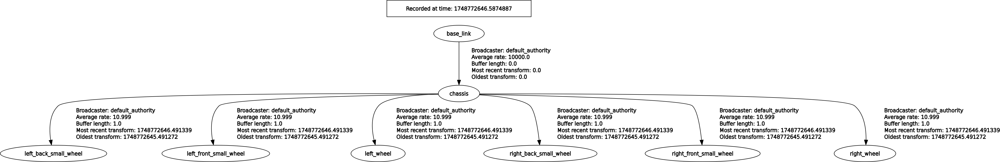
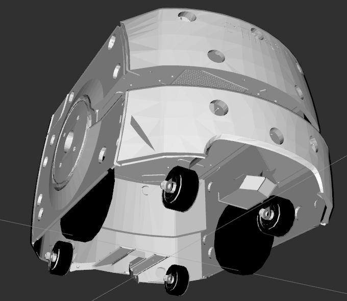

- [Required Installations](#required-installations)
- [Create Package](#create-package)
- [Gazebo](#gazebo)
- [Launch rsp, spawn robot and gazebo launch file together](#launch-rsp-spawn-robot-and-gazebo-launch-file-together)
- [Gazebo Lidar](#gazebo-lidar)
- [Gazebo camera](#gazebo-camera)
- [Important ROS2 Commands](#important-ros2-commands)


# Required Installations 

- **Robot State Publisher**: Publishes the state (pose) of a robot's links using its URDF and joint states.
- **Joint State Publisher**: Simulates and publishes joint positions for robots, typically used when no hardware is available.


Install join state piblisher 
```
sudo apt install ros-humble-joint-state-publisher
```

install joint install publisher gui
```
sudo apt install ros-humble-joint-state-publisher-gui
```

install xacro package
```
sudo apt install ros-humble-xacro
```


# Create Package
Now create ROS2 package using 
```
ros2 pkg create --build-type ament_cmake --license Apache-2.0 emma_visualization
```

And then add directories description launch and meshes

Add your urdf.xacro files in description.

> **_NOTE:_**  Load rviz2 using ```ros2 run rviz2 rviz2``` after sourcing terminal properly 

Create a launch file and include robot state publisher as this node provide topics like /tf /tf_static and /robot_description however provide a path of a xacro file from description directory to robto_state_publisher as a paramter

```
cd schaeffler_ws && colcon build --symlink-install 
source install/setup.bash
ros2 launch emma_visualization rsp.launch.py
```

Then run rviz2 ```ros2 run rviz2 rviz2```

Provide joint states as robot wheels are expecting some join values
```
ros2 run joint_state_publisher_gui joint_state_publisher_gui
```

In Rviz2 change frame_id from world to base_link becuase the root of the robot is set as base_link
add TF and robot_model and check if transform tree looks correct.



Ensure the robot wheels are perfectly aligned with z axis upward of allsix wheels 





# Gazebo
Now that we have written robot state publisher node and we can visualize robot in rivz now is the time to run the robot in gazebo and spawn the robot in gazebo. 

> **_NOTE:_** Ensure to launch robot state publisher with use_sim_time:= true becuase we gonna be running it on gazebo time 

Launch gazebo and see if it is loading 
```
ros2 launch gazebo_ros gazebo.launch.py
```


# Launch rsp, spawn robot and gazebo launch file together 
```
ros2 launch emma_visualization launch_sim.launch.py 
```

Move robot with teleop twist keyboard this will publish command velocities on cmd_vel topic 
```
ros2 run teleop_twist_keyboard teleop_twist_keyboard
```

If you want create a world in gazebo and save the world in worlds directory after deleting robot

Load the gazebo world 

```
ros2 launch emma_visualization launch_sim.launch.py world:=./src/emma_visualization/worlds/powerplant.world
```

This would load the gazebo world with a robot at origin 

> **Note:** I have kept the supporting wheel fixed as this is a diff drive robot but in case due to large friction i should add mu values as zero in corresponding gazebo tags


```
    <gazebo reference="caster_wheel">
        <material>Gazebo/Black</material>
        <mu1 value="0.001"/>
        <mu2 value="0.001"/>
    </gazebo>
```


# Gazebo Lidar
...
 
# Gazebo camera

install following packages for rendering compressed images in rviz 
```
sudo apt install ros-humble-image-transport-plugins 
sudo apt install ros-humble-rqt-image-view
```

You can later visualize compressed images in rqt-image view because for some reason rviz2 does not render compressed images 
```
ros2 run rqt_image_view rqt_image_view 
```
# Ros2 control

Later i will make a seperate branch and integrate ros2 control as this is for real robot control. 
Beacuase i dont want to rely on gazebo plugin. 
https://articulatedrobotics.xyz/tutorials/mobile-robot/applications/ros2_control-concepts/


# SLAM with ROS using slam_toolbox


add basefoot print link as a parent of baselink for SLAM 
baseline -> basefootprint 


then install slam toolbox if it is not already installed on the system

```
sudo apt install ros-humble-slam-toolbox
```


now copy the paramter file for slam toolbox 

```
cp /opt/ros/humble/share/slam_toolbox/config/mapper_params_online_async.yaml /home/schaeffler/schaeffler/src/emma_visualization/config/
```
This is provide the ```map``` frame id as can be noticed in mapper_params_online_async.yaml file in config directory.

run gaqazebo launch file and in seperate terminal launch slam toolbox for mapping ]

```
ros2 launch slam_toolbox online_async_launch.py slam_params_file:=./src/emma_visualization/config/mapper_params_online_async.yaml use_sim_time:=true

```

In rviz change the frame id now to map as now the perspective is relative to map frame id.  

move the robot around and save the map through slamtool box plugin in rviz. this will provide .pgm and .data files as your map files which we can later use it load for localization 

now  change mode in mapper_prams_online_async file fmode: mapping to localization ... and rerun this should load the saved map

the map should appear in rviz and you should be able to see the saved map


# Lcalization using AMCL

```
sudo apt install ros-humble-navigation2 ros-humble-nav2-bringup ros-humble-turtlebot3*
```


```
ros2 run nav2_map_server map_server --ros-args -p yaml_filename:=maps/my_map_save.yaml -p use_sim_time:=true
```

this shoul load the saved map file and make that available of the /map topic but in a seperate run 
```
ros2 run nav2_util lifecycle_bringup map_server

```
After that you can see the map image file is loaded in nav2_map_server terminal .
run rviz2 and gazebo launch .


...................
# Run AMCL

```
ros2 run nav2_amcl amcl -p use_sime_time:=true
```

now run with 
```
ros2 run nav2_util lifecycle_bringup amcl
```
After moving the robot in gazebo give 2d goal pose in rviz to localize

# Nav2 stack
```
sudo apt install ros-humble-twist-mux
```

to remap command velocities on a single topic regardless if it is comming from nav2, joystick or keyboard ...

Add twist_mux in configuation directory and edit the priority.
```
ros2 run twist_mux twist_mux --ros-args --params-file ./src/emma_visualization/config/twist_mux.yaml -r cmd_vel_out:=diff_cont/cmd_vel_unstamped
```
now the commad velocity are remapped to cmd_vel_unstamped 


Steps to be followed for navigation stack
- run gazebo
- run rviz2 
- run slam tool box 
```
ros2 launch slam_toolbox online_async_launch.py slam_params_file:=./src/emma_visualization/config/mapper_params_online_async.yaml use_sim_time:=true
```
try with localization_launch.py file as well for the slam_toolbox
or 

```
ros2 launch nav2_bringup localization_launch.py map:=./maps/my_map_save.yaml use_sim_time:=true
```
but give inital pose after the map is loaded ...

- run ```ros2 launch nav2_bringup navigation_launch.py use_sim_time:=true``` if neded add one extra paramater map_subscribe_transient_local:=true this tells nav2 to listen to the map at the start up


So add two more maps ..in total three maps 
default saved map, local and global map 


# Adding launch files locally 
```
cp /opt/ros/humble/share/nav2_bringup/params/nav2_params.yaml src/emma_visualization/config/

cp /opt/ros/humble/share/nav2_bringup/launch/navigation_launch.py src/emma_visualization/launch/

cp /opt/ros/humble/share/nav2_bringup/launch/localization_launch.py src/emma_visualization/launch/

cp /opt/ros/humble/share/nav2_bringup/launch/navigation_launch.py src/emma_visualization/launch/
```

and change the directory name to your package name ie emma_visualization 


launch gazebo and rviz 
launch localization file 
```
ros2 launch emma_visualization localization_launch.py use_sim_time:=true map:=./maps/my_map_save.yaml 
```
launch navigation 
```
ros2 launch emma_visualization navigation_launch.py use_sim_time:=true
```

# Important ROS2 Commands
``` 
ros2 run rqt_tf_tree rqt_tf_tree 
```


Testing robot state publisher directly through terminal, before doing that download ```example_robot.urdf.xacro``` file as this is the robot_description file
```
ros2 run robot_state_publisher robot_state_publisher --ros-args -p robot_description:="$(xacro ./Downloads/example_robot.urdf.xacro)"
```

Run to provide joint values to the robot arm
```
ros2 run joint_state_publisher_gui joint_state_publisher_gui 
```

open rviz2 to visualize add tf and robot model-> add the topic robot_description 
```
rviz
```

to visualize frame_id and transforms live
```
ros2 run rqt_tf_tree rqt_tf_tree 
```

or using tf2 tool but this would save pdf in home directory
```
ros2 run tf2_tools view_frames 
```