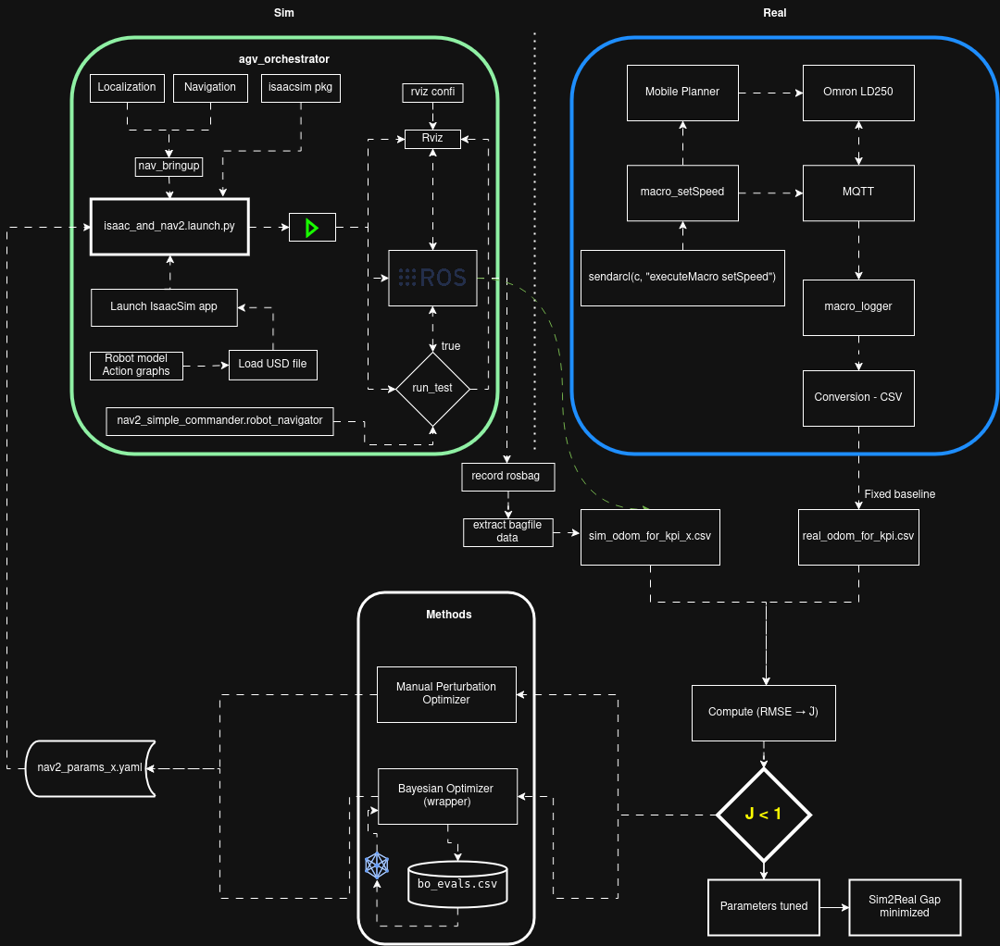
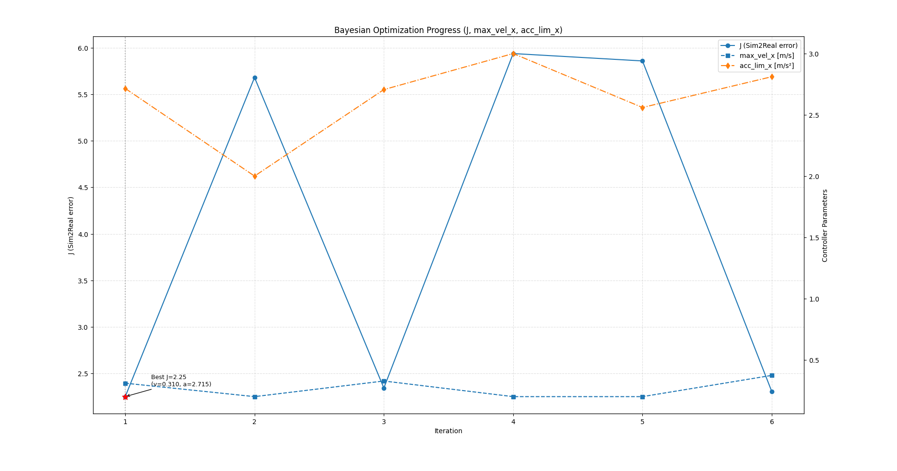
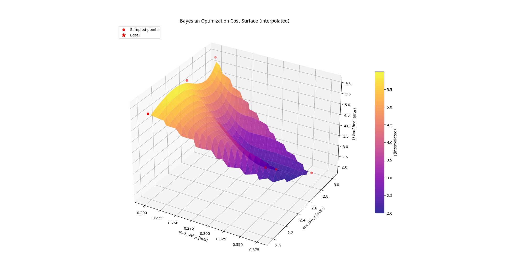
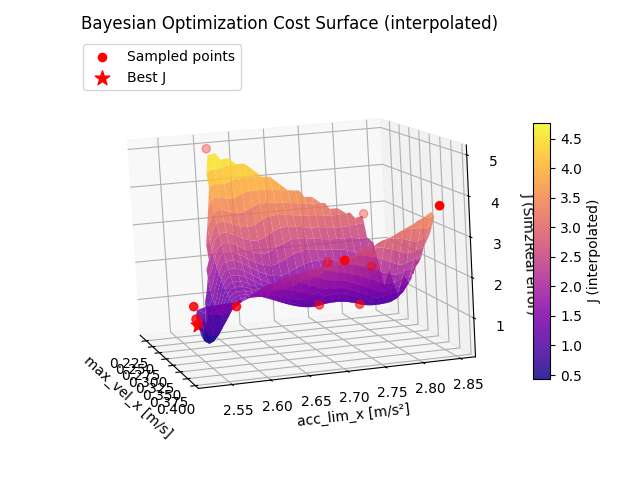
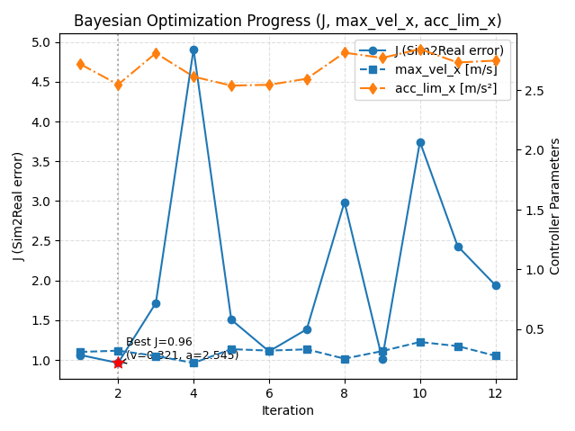

# System Architecture



### ROS2 Tutorials

## Driving TurtleBot via ROS2 messages [Setup link](https://docs.omniverse.nvidia.com/isaacsim/latest/ros_tutorials/tutorial_ros_drive_turtlebot.html)

- Drive the robot using the Differential Controller and the Articulation Controller

- Subscribing to a ROS2 Twist message on /cmd_vel topic 


## ROS2 Clock [Setup link](https://docs.isaacsim.omniverse.nvidia.com/latest/ros2_tutorials/tutorial_ros2_clock.html)

- Explanation for using the /clock topic and the use_sim_time ROS parameter for time synchronization.

- Creating and using ROS2 Clock Publisher and Subscriber nodes.


```bash

ros2 run rviz2 rviz2 
ros2 param set /rviz use_sim_time true

```

To verify the rviz time is same as simulation time , the ros time and ros elapsed time would be same


## ROS2 Publish Real Time Factor [Setup link](https://docs.isaacsim.omniverse.nvidia.com/latest/ros2_tutorials/tutorial_ros2_rtf.html)

it should be close to 1. if RTF <1 it means simulation time is running slower than the real time.

```ros2 topic echo /RTF_topic```


##  ROS2 Cameras [setup link](https://docs.isaacsim.omniverse.nvidia.com/latest/ros2_tutorials/tutorial_ros2_camera.html)

Dont forget to move the robot into the 

Learn how to publish camera programatically [publishing camera data ]()


## ROS2 Lidar [Lidar sensor](https://docs.isaacsim.omniverse.nvidia.com/latest/ros2_tutorials/tutorial_ros2_rtx_lidar.html)

- Briefly introduce how to use RTX Lidar sensors.

- Create a RTX Lidar sensor.

- Publish sensor data to ROS2 as LaserScan and PointCloud2 messages.

- Use the menu shortcut to create RTX Lidar sensor publishers.

- Put it all together and visualize multiple sensors in RViz2.


## [ROS2 Transform Trees and Odometry](https://docs.isaacsim.omniverse.nvidia.com/latest/ros2_tutorials/tutorial_ros2_tf.html#isaac-sim-app-tutorial-ros2-tf)


### How i rigged emma robot 

- import usd
- Inser physics ground plane and physics scene and in physics scene increase the Time steps per second value from 60 to 290
- created xforms of body and wheels
- local corrdinates of all xforms set as y pointing sideways, xoforward and z upward. To ensure body and wheel local rotations are aligned. It does not matter the orientation of the child prims as long as the orientation of xforms are aligned.
- Give rigid body API to xforms and collider API to child of xforms
- Select body then xforms individually and create a revelote joint 
- Add angular derive to Revolute joints and change the rotation axis to Y because in local coordinates the rotation is around Y
- For organization i moved the joints to joints scope and renamed it 
- Using measure tool i measure the distance between wheel and radius of the wheel
- give articulationa root api to the root of the emma robot. in my case Emma_cobot
- In differential drive omnigraph i added these values and the names of the joints. Emma_cobot has articulation root api so this would be the target prim 
- Run  


### Encountered Issue 
- The damping was too low and because of that i was not able to rotate and move with teleop twist keyboard [Configure link](https://docs.omniverse.nvidia.com/isaacsim/latest/advanced_tutorials/tutorial_advanced_joint_tuning.html)


- The reason why laser was moving along with robot was becuase i used the wrong frame id, the frameid is supposed to be the xform under which the lidar is placed.


### Runnning process
This would match isaac sim time and ros2 time.
```ros2 param set /rviz use_sim_time true```

##### Issue: Discrepancy in Robot Motion Visualization (Isaac Sim vs. RViz)

**Problem:**
* The robot's actual direction of motion within Isaac Sim appeared opposite to its displayed movement in RViz.
* This occurred despite verifying that `cmd_vel` commands were being sent correctly and interpreted as "forward" in Isaac Sim.

**Root Cause:**
* The primary reason was a misalignment in coordinate frame conventions. Specifically, the forward axis (+X) of the robot's base link (or the lidar's frame which dictates the base's orientation) within the Isaac Sim model was oriented differently from the expected ROS REP 103 standard for the `base_link` frame in RViz.

**Solution:**
* The orientation of the lidar (or the robot's base link itself) was adjusted within the Isaac Sim stage (or its corresponding URDF/USD definition).
* This adjustment ensured that the +X axis of the `base_link` frame, as published via TF to RViz, accurately represented the robot's forward direction of travel in the simulation.

**Outcome:**
* The robot's motion in Isaac Sim and its visualization in RViz now correctly correspond, providing an accurate representation of the robot's state.

Right now i am going through [Core API Tutorial Series](https://docs.isaacsim.omniverse.nvidia.com/latest/core_api_tutorials/index.html#isaac-sim-core-api-tutorials-page)


### Navigation stack process
# ROS 2 Navigation Workflow with Isaac Sim Turtlebot

## Workflow Steps

1. **Create the Map**
   - Launch SLAM Toolbox:
     ```
     ros2 launch slam_toolbox online_async_launch.py use_sim_time:=true
     ```
   - Launch RViz2:
     ```
     ros2 run rviz2 rviz2
     ```
   - In RViz2:
     - Set **Fixed Frame** to `map`.
     - Enable **Use Sim Time**:
       ```
       Panels > Displays > Global Options > Use Sim Time: True
       ```
     - If the occupancy grid does not show, set **Durability Policy** of the Map display to **Transient Local**.
   - Save the map:
     ```
     ros2 run nav2_map_server map_saver_cli -f ~/nav2_config/maps/my_map
     ```

2. **Localization**
   - Launch localization with your saved map:
     ```
     ros2 launch nav2_bringup localization_launch.py \
       map:=/home/schaeffler/nav2_config/maps/my_map.yaml \
       use_sim_time:=true
     ```
   - In RViz2, click **2D Pose Estimate** to set the initial pose.
   - Confirm laser scan and point cloud align with the map.

3. **Navigation**
   - Launch navigation:
     ```
     ros2 launch nav2_bringup navigation_launch.py \
       use_sim_time:=true \
       param_file:=/home/schaeffler/nav2_config/nav2_params.yaml
     ```
   - In RViz2, click **2D Nav Goal** to send a goal.

## Notes
- Keep `base_frame_id` consistent (`base_footprint` or `base_link`).
- Make sure Isaac Sim publishes `/clock`.
- Always set **Use Sim Time** in RViz2.
- Confirm `/tf` tree shows:
  ```
  map -> odom -> base_link
  ```
- If the map or transforms are missing, re-check:
  - Durability Policy (`Transient Local`).
  - Sim time synchronization.
  - Initial pose estimate.

✅ Done! Your robot should now localize and navigate in simulation.


# ROS 2 Navigation Workflow with Isaac Sim Emma robot

This guide documents the complete workflow to create a map, localize, and navigate using Nav2 with simulation time in Isaac Sim.

---

## 🟢 1. Start Isaac Sim
Launch Isaac Sim and ensure `/clock` is being published for simulation time.

---

## 2. Build the Map with SLAM Toolbox
Launch SLAM Toolbox:

```bash
ros2 launch slam_toolbox online_async_launch.py use_sim_time:=true
```
Move the robot around in the environment

## 3. Save the Map
Launch SLAM Toolbox:
```
ros2 run nav2_map_server map_saver_cli -f ~/nav2_config/maps/my_map
```

This creates:
- my_map.yaml
- my_map.pgm


## 4. Launch RViz

```
rviz2 
```
```
ros2 param set /rviz use_sim_time true
```

## 5. Launch Localization
```
ros2 launch nav2_bringup localization_launch.py \
  map:=/home/schaeffler/nav2_config/maps/my_map.yaml \
  use_sim_time:=true
```

Important:

- In RViz, set the Map display Durability Policy to Transient Local so the map appears.

- Use 2D Pose Estimate in RViz to set the initial robot pose.


## 6. Launch Navigation 
```
ros2 launch nav2_bringup bringup_launch.py \
  map:=/home/schaeffler/nav2_config/maps/my_map.yaml \
  use_sim_time:=true \
  params_file:=/home/schaeffler/nav2_config/nav2_params.yaml
```

And in rviz now you can give navigation goal 

## Recap of Common Issues and Fixes

- Map Not Showing in RViz: Change the Durability Policy to Transient Local.

- Time Sync Errors: Always set use_sim_time to true everywhere and run ros2 param set /rviz use_sim_time true.

- TF Issues: Make sure you use consistent base_frame_id (e.g., base_footprint) and odom/map frames in AMCL and Nav2 configs.

- Startup Order: Always launch Isaac Sim first, then SLAM, then save the map, then Localization, and finally Navigation.


# Manual Tuning 
## Sim2Real Parameter Tuning for AGV Simulation

The objective is to tune simulation parameters (especially damping) to ensure the robot's simulated motion accurately replicates commanded velocities.

## 📈 Objectives

- Compare `/cmd_vel` commands vs. `/odom` measured velocities.
- Quantify error using RMSE.
- Iteratively adjust physics parameters to minimize RMSE.
- Document results at each step.


5. **Adjust Parameters:**
- Reduce damping iteratively.
- Re-run the process.

6. **Track Results:**
- Record RMSE for each damping value.

## 🧪 Iterative Tuning Process

Below is the table tracking each experiment:

| Iteration | Damping Value | Max Force | RMSE Linear Velocity (m/s) | RMSE Angular Velocity (m/s) | 
|-----------|---------------|-----------|----------------------------|----------------------------|
| 1         | 1e9           | unlimited | 0.4447                     | 0.7639                     | 
| 2         | 1e8           |     unlimited      | 0.4075            | 0.6656                     |  
| 3         | 1e7           |      unlimited    |                   Robot stoped           |             Robot stoped               

---

## Monday Troubleshooting Plan & Checklist

### 1. Confirm the Problem
- [ ] Identify if `/odom` drifts away from the true pose (ground truth) in Isaac Sim.

### 2. Odometry Diagnostics
- [ ] Check if Isaac Sim publishes a ground truth pose topic (e.g., `/ground_truth_pose`).
- [ ] Plot `/odom` vs. ground truth in PlotJuggler to visualize drift.
- [ ] Plot `/cmd_vel` vs. `/odom` in PlotJuggler to check for slippage or lag.

### 3. Physics Parameter Tuning in Isaac Sim
- [ ] Increase wheel friction and damping values.
- [ ] Test and record RMSE between `/cmd_vel` and `/odom` for each change.
- [ ] Observe robot motion for signs of slippage.

### 4. Navigation/Localization Parameter Tuning
- [ ] Set `laser_min_range: 0.5` and `laser_max_range: 8.0` (or 10.0) in `nav2_params.yaml`.
- [ ] Increase `min_particles` and `max_particles` in AMCL (e.g., 1000 and 5000).
- [ ] Increase `alpha1` and `alpha2` (e.g., 0.4) if odometry is noisy.
- [ ] Lower `update_min_d` and `update_min_a` (e.g., 0.1) for more frequent AMCL updates.

### 5. Debugging and Validation
- [ ] Launch localization and navigation.
- [ ] Set initial pose in RViz and send a goal.
- [ ] Observe if scan stays aligned with the map and robot reaches the goal.
- [ ] If still failing, try using Isaac Sim’s ground truth as `/odom` for debugging.

### 6. Documentation
- [ ] Update the Troubleshooting Change Log in `README_ISAAC.md`.
- [ ] Document all parameter changes, results, and observations.

---

### Key Parameters Table

| Parameter                | Where                | Why/What to Try                |
|--------------------------|----------------------|--------------------------------|
| Wheel friction/damping   | Isaac Sim            | Reduce slippage, improve odom  |
| `laser_min_range`        | nav2_params.yaml     | Match lidar hardware           |
| `laser_max_range`        | nav2_params.yaml     | Match lidar hardware           |
| `min_particles`          | nav2_params.yaml     | Increase for robust AMCL       |
| `max_particles`          | nav2_params.yaml     | Increase for robust AMCL       |
| `alpha1`, `alpha2`       | nav2_params.yaml     | Increase if odom is noisy      |
| `update_min_d`, `update_min_a` | nav2_params.yaml | Lower for more frequent AMCL updates |

---

You will now find the Monday Troubleshooting Plan & Checklist and the Key Parameters Table at the end of your `README_ISAAC.md` file. This will help you stay organized and focused when you return to your project!


---

## Problem: Costmap Sensor Origin Out of Bounds

**Error Message:**
```
[local_costmap.local_costmap]: Sensor origin at (X, Y, Z) is out of map bounds (A, B, C) to (D, E, F). The costmap cannot raytrace for it.
```

**What it means:**
- The sensor (usually lidar) is outside the area covered by the local costmap, so the costmap cannot update or raytrace obstacles correctly.

**Problem Analysis Process:**
1. **Initial attempts:** Increased local costmap width and height from 5x5 to 6x6, 7x7, 8x8, and even 10x10 meters
2. **TF tree investigation:** Verified that base_link → base_scan transform was correct
3. **Sensor configuration:** Checked Isaac Sim lidar settings and ROS2 scan topic frame_id
4. **Costmap parameters:** Updated scan range parameters to match Isaac Sim lidar settings
5. **Root cause discovery:** Identified that the issue was caused by using a **voxel_layer** with a **2D lidar**

**Root Cause:**
- **Voxel layers are designed for 3D sensors** (PointCloud2 data from depth cameras, 3D lidars, stereo cameras)
- **2D lidars produce LaserScan messages** with 2D points in a horizontal plane
- **Mismatch:** The voxel layer was trying to process 2D laser data as if it were 3D, causing 3D bounds checking to fail

**Solution:**
- **Removed voxel_layer** from local_costmap plugins
- **Kept obstacle_layer and inflation_layer** for 2D navigation

**Result:**
- ✅ Warnings completely disappeared
- ✅ 2D navigation functionality preserved
- ✅ Optimized costmap configuration for 2D lidar
- ✅ No performance impact from unnecessary 3D processing

**Key Learning:**
- **2D navigation** → **2D obstacle detection** (obstacle_layer)
- **3D navigation** → **3D obstacle detection** (voxel_layer)
- Always match sensor type with appropriate costmap layers

---

## Session Change Log - 2024-07-21

- Changed local costmap width and height to 5 (from previous value)
- Changed robot_radius value in both local and global costmaps
- Added QoS node to each OmniGraph publisher in Isaac Sim (including LaserScan, TF, etc.)

---


---

## Parameter Change Log: Inflation Radius

| Parameter         | Location                | Old Value | New Value | Observed Effect in Simulation                         |
|-------------------|-------------------------|-----------|-----------|------------------------------------------------------|
| robot_radius      | local/global costmap    | 0.22/0.45 | 0.95      | Costmap warning disappeared, safer obstacle avoidance|
| inflation_radius  | local_costmap           | 0.55      | 0.95      | Robot avoids new/dynamic obstacles, fewer collisions |
| inflation_radius  | global_costmap          | 0.55      | 0.95      | Robot plans safer paths, keeps distance from obstacles|

**Impact:**
- Increasing the robot_radius and inflation_radius to match the robot's true size improved obstacle avoidance and eliminated costmap warnings.
- The robot now avoids both static and newly added obstacles in the environment, reducing collisions.
- The inflation radius determines the "buffer zone" around obstacles in the costmap, and should be at least as large as the robot's radius for safe navigation.

---


---

## Session Change Log - 2024-07-23

| Change                                      | Location/Parameter         | Old Value         | New Value         | Effect/Notes                                      |
|----------------------------------------------|---------------------------|-------------------|-------------------|---------------------------------------------------|
| Changed global_frame from odom to map        | local_costmap             | odom              | map               | Costmap frame matches published data              |
| Commented out voxel_layer                    | local_costmap plugins     | Included          | Commented out     | Simplified costmap, easier debugging              |
| Added obstacle_layer to plugins              | local_costmap plugins     | Not present       | Added             | Real-time obstacles now marked in costmap         |

**Result:**
- Robot is now avoiding real-time obstacles in the scene.
- Laser scan is not perfectly aligned (may need further tuning).

---


## Launch with bringup file

Launch localization and navigation from single bring up file aftter running isaac sim.
```
cd /home/schaeffler/schaeffler
source install/setup.bash
ros2 launch nav_bringup bringup_launch.py use_sim_time:=true map:=src/nav_bringup/maps/slam_map.yaml
```
Open rviz2
```
ros2 run rviz2 rviz2 --ros-args -p use_sim_time:=true
```

Localize the robot and send waypoints/gothrough poses programatically
```
source ros2env/bin/activate
python nav2_test.py 
```

## IsaacSim Launch Command

Build the workspace
```bash
cd ~/IsaacSim-ros_workspaces/humble_ws
colcon build --symlink-install
source install/setup.bash
```

To load your USD file into IsaacSim and automatically play the simulation on startup, use the following `ros2` launch command:

```bash
ros2 launch isaacsim run_isaacsim.launch.py gui:="/path/to/your/file.emma.usd" play_sim_on_start:="true"
```


Relative path of usd file can also be given, make sure the paht

```bash
ros2 launch isaacsim run_isaacsim.launch.py gui:="~/Downloads/omron_emma/emma.usd" play_sim_on_start:="true" 
```


# Automatic Tuning using bayesian optimzation

```bash
cd /home/schaeffler/schaeffler/src/GetSetParams 
python3 dummpy_BO.py
```

Iteration count: 6



The bayesian optimzer suggested
```bash
=== BO SURFACE SUMMARY ===
Total iterations: 6
Best J = 2.250520 at iter=1
  max_vel_x = 0.309763
  acc_lim_x = 2.715189
```

### Surface plot for 6 iterations


---

## How Bayesian Optimization Works in This Project

### Overview
The `BO.py` script uses **Bayesian Optimization (BO)** to automatically tune Nav2 controller parameters (`max_vel_x` and `acc_lim_x`) to minimize the tracking error (KPI metric `J`) between simulation and real robot behavior.

### Key Components

#### 1. Search Space Definition
```python
pbounds = {
    "max_vel_x": (0.20, 0.40),
    "acc_lim_x": (2.0, 3.0),
}
```
- BO explores parameter combinations within these bounds
- You can adjust these ranges based on your robot's capabilities

#### 2. Black-Box Function (`objective`)
This is the function BO tries to optimize:

```python
def objective(max_vel_x, acc_lim_x):
    # 1. Write proposed parameters to nav2_params_bo.yaml
    write_params(max_vel_x, acc_lim_x)
    
    # 2. Launch full simulation pipeline (Isaac Sim + Nav2 + KPI)
    J = run_one_sim(max_vel_x, acc_lim_x)
    
    # 3. Log iteration results to bo_evals.csv
    append_eval(iteration, max_vel_x, acc_lim_x, J)
    
    # 4. Return negative J (BO maximizes, we want to minimize J)
    return -J
```

**What "black-box" means:**
- BO doesn't know the internal workings of the simulation or KPI calculation
- It only observes: input parameters → output value (J)
- BO builds a surrogate model (Gaussian Process) to predict which parameters will give better results

#### 3. Workflow Per Iteration

For each iteration, the system:

1. **Parameter Proposal**: BO proposes new `max_vel_x` and `acc_lim_x` values
2. **Config Update**: `write_params()` updates `nav2_params_bo.yaml` with proposed values
3. **Simulation Launch**: `run_one_sim()` executes:
   ```bash
   ros2 launch agv_orchestrator isaac_and_nav2.launch.py \
       rviz:=false \
       run_test:=true \
       compute_kpi:=true \
       params_file:=nav2_params_bo.yaml
   ```
4. **Test Execution**: `nav2_test.py` runs, robot navigates to goal, odometry logged to `logs/nav2_run_N.csv`
5. **KPI Computation**: `compute_kpi_normalized.py` automatically runs after test completion:
   - Compares sim trajectory (`nav2_run_N.csv`) with real robot baseline (`omron_run.csv`)
   - Computes position RMSE, orientation RMSE, and combined metric J
   - Writes J to `logs/J_nav2_run_N.txt`
6. **Result Retrieval**: `load_latest_J()` reads the newest J file
7. **Logging**: Results saved to `bo_evals.csv` for post-analysis
8. **BO Update**: BO updates its internal model with the new (params, J) observation

#### 4. Optimization Strategy

```python
optimizer = BayesianOptimization(
    f=objective,        # Black-box function to optimize
    pbounds=pbounds,    # Search space bounds
    verbose=2,          # Print every step
    random_state=0,     # Reproducible results
)

optimizer.maximize(
    init_points=1,      # Random exploration points (pure random sampling)
    n_iter=5,           # BO-guided iterations (smart sampling)
)
```

**Two-phase approach:**
- **Exploration phase** (`init_points=1`): Random sampling to gather initial data
- **Exploitation phase** (`n_iter=5`): BO uses Gaussian Process to intelligently select next parameters that are likely to improve performance

#### 5. Why Return `-J`?

```python
return -J  # BO maximizes, we minimize J
```

- Bayesian Optimization **maximizes** the objective function
- Our KPI `J` represents error (lower is better)
- By returning `-J`, we convert minimization → maximization
- BO finds parameters that maximize `-J` = minimize `J`

#### 6. Output and Results

After optimization completes:
- **Console output**: Best parameters found
- **`bo_evals.csv`**: Complete history of all iterations (iter, max_vel_x, acc_lim_x, J)
- **Surface plots**: Visualize how J varies across the parameter space (generated from `bo_evals.csv`)

### Advantages of Bayesian Optimization

1. **Sample Efficient**: Finds good parameters with fewer simulation runs compared to grid search
2. **Principled Exploration**: Balances trying new areas (exploration) vs. refining known good regions (exploitation)
3. **Handles Expensive Evaluations**: Each simulation takes minutes; BO intelligently selects which parameters to try next
4. **No Gradient Required**: Works with black-box simulation where gradients are unavailable

### Customization

To tune different parameters or change search ranges:

1. **Add parameters** to `pbounds`:
   ```python
   pbounds = {
       "max_vel_x": (0.20, 0.40),
       "acc_lim_x": (2.0, 3.0),
       "max_vel_theta": (0.5, 2.0),  # Add rotation velocity
   }
   ```

2. **Update `write_params()`** to modify the new parameters in `nav2_params_bo.yaml`

3. **Update `objective()` signature** to accept the new parameters:
   ```python
   def objective(max_vel_x, acc_lim_x, max_vel_theta):
       write_params(max_vel_x, acc_lim_x, max_vel_theta)
       # ... rest of code
   ```

4. **Adjust iteration counts** in `optimizer.maximize()` based on dimensionality:
   - More parameters → need more iterations
   - Rule of thumb: `init_points ≈ n_params`, `n_iter ≥ 5*n_params`

---

To better visualize how BO explores different samples, the BO ran for 12 iteration and here this is how the surface looks like,

Still surface plot for 12 iteration: 



 take a look at the GIF:


To visualize all the iteration and its corresponding J values, take a look at the plot

