# Sim2Real KPI Workflow and Findings

This document describes the process used to collect real and simulated trajectory data, preprocess both datasets, compute alignment KPIs, and evaluate tuning iterations for Sim2Real matching.

## Table of Contents

- [Sim2Real KPI Workflow and Findings](#sim2real-kpi-workflow-and-findings)
  - [Table of Contents](#table-of-contents)
  - [Overview](#overview)
  - [Data Collection and Preprocessing Pipeline](#data-collection-and-preprocessing-pipeline)
    - [Step 1: Convert Simulated Data (rosbag to CSV)](#step-1-convert-simulated-data-rosbag-to-csv)
    - [Step 2: Record Real Robot Data (MQTT)](#step-2-record-real-robot-data-mqtt)
    - [Step 2A: Macro-Based Logging (LD-250)](#step-2a-macro-based-logging-ld-250)
      - [Robot pose message fields and unit conversion](#robot-pose-message-fields-and-unit-conversion)
      - [Macro workflow](#macro-workflow)
      - [Default Omron configuration notes](#default-omron-configuration-notes)
    - [Step 3: Full End-to-End Run](#step-3-full-end-to-end-run)
  - [Running `compute_kpis.py`](#running-compute_kpispy)
  - [Tolerance Selection Based on Omron LD250 Datasheet](#tolerance-selection-based-on-omron-ld250-datasheet)
    - [Problem](#problem)
    - [Thresholds](#thresholds)
    - [Results](#results)
  - [Pilot KPI Evaluation](#pilot-kpi-evaluation)
  - [Finding: Effect of Differential Controller Caps](#finding-effect-of-differential-controller-caps)
    - [Observed Configurations](#observed-configurations)
    - [Key Observation Table](#key-observation-table)
  - [Sim2Real Alignment Process](#sim2real-alignment-process)
    - [Objective](#objective)
    - [Method](#method)
    - [Visualizations](#visualizations)
  - [Iteration Summary](#iteration-summary)
  - [Detailed Iterations (5-7)](#detailed-iterations-5-7)
    - [Manual check snapshot](#manual-check-snapshot)
    - [Iteration 5: Remove DCN cap values](#iteration-5-remove-dcn-cap-values)
    - [Iteration 6: Increase ROS velocity toward real robot profile](#iteration-6-increase-ros-velocity-toward-real-robot-profile)
    - [Iteration 7: Reduce acceleration by 50%](#iteration-7-reduce-acceleration-by-50)
    - [J progression plot](#j-progression-plot)
  - [Conclusion](#conclusion)

## Overview

The objective is to align the simulated AGV trajectory with the real robot trajectory by minimizing:

- `RMSE_pos` (position error)
- `RMSE_psi` (yaw error)
- `J_tilde` (normalized combined KPI)

A practical pass criterion is:

- `J_tilde <= 1.0`

## Data Collection and Preprocessing Pipeline

### Step 1: Convert Simulated Data (rosbag to CSV)

- Convert rosbag output to CSV using the extraction script.
- Preprocess with:
  - Trimming by motion (`vx > 0.02 m/s`) and goal proximity.
  - Time zeroing (`t = t - t0`) for both real and sim logs.

```bash
python preprocess.py
```

- Plot for quick validation:

```bash
python plot.py
```

### Step 2: Record Real Robot Data (MQTT)

- MQTT endpoint:
  - Host: `192.168.18.3`
  - Port: `8883`
  - TLS enabled

- Subscribed topics:
  - `itk/dt/robot/pose`
  - `itk/dt/robot/status`

- Logging logic:
  - Record pose only when `status == "Driving"`.
  - Output format: `t, x, y, yaw` where:
    - `t` in seconds
    - `x, y` in meters
    - `yaw` in radians

```bash
python mqtt.py
```

### Step 2A: Macro-Based Logging (LD-250)

This section consolidates the macro-based real robot logging workflow used for controlled speed runs and KPI-ready CSV generation.

#### Robot pose message fields and unit conversion

The Omron LD-250 publishes pose data on `itk/dt/robot/pose`. Use the following conversions before KPI processing.

| Field | Description | Message Unit | SI Unit | Conversion |
|---|---|---|---|---|
| `x` | Position along X-axis | millimeters (mm) | meters (m) | `x_m = x / 1000` |
| `y` | Position along Y-axis | millimeters (mm) | meters (m) | `y_m = y / 1000` |
| `th` | Orientation (theta/yaw) | degrees (milli-scaled payload) | radians (rad) | `th_rad = th / 1000` |
| `upd` | Pose update timestamp | Unix time in ms | seconds (s) | `t_s = upd / 1000` |

#### Macro workflow

- `macro/macro_setSpeed.py`: Sends temporary speed macro commands to the robot for a run.
- `macro/macro_logger.py`: Logs converted runtime data in `t, x, y, yaw, v_x` format.
- `macro/plot_robot_csv.py`: Transforms logged data and generates plots plus KPI-ready CSV outputs.

Example output plot:

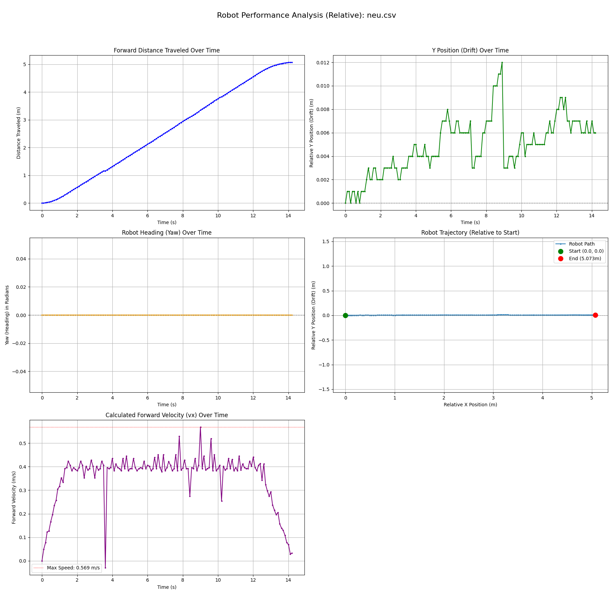

#### Default Omron configuration notes

- Macro speed changes are temporary and apply only for the active test run.
- During acquisition, multiple speed settings were evaluated (for example, `100 mm/s` straight-line motion).

Reference images:

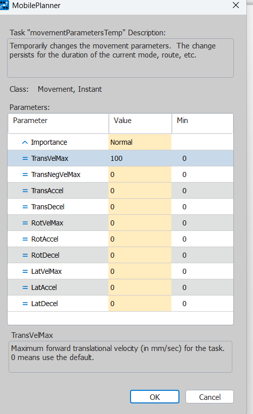
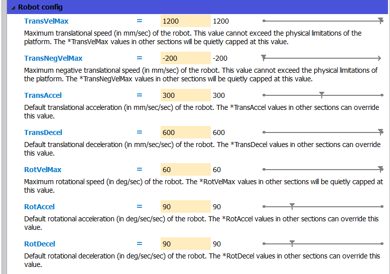

### Step 3: Full End-to-End Run

1. Log real robot data to `real_log_for_kpi.csv`.
2. Convert and preprocess simulation data to `sim_log_for_kpi.csv`.
3. Run KPI computation.

## Running `compute_kpis.py`

Input:

- Two CSV files in `t,x,y,yaw` format (`real` and `sim`).

Preprocessing inside KPI workflow:

- Normalize both trajectories to the same start pose and initial yaw.
- Resample both signals to `10 Hz` over overlapping time range.

KPI outputs:

- `RMSE_pos`
- `RMSE_psi`
- `J_tilde`

Command:

```bash
python compute_kpis.py --real real_log_for_kpi.csv --sim sim_log_for_kpi.csv
```

## Tolerance Selection Based on Omron LD250 Datasheet

### Problem

`J_tilde` was initially high due to strict default thresholds and large position deviation between real and simulated trajectories.

### Thresholds

- Initial:
  - `T_pos = 0.03 m`
  - `T_psi = 0.02 rad` (about 1.15 deg)

- LD250-based:
  - `T_pos = 0.1 m`
  - `T_psi = 0.0349 rad` (2 deg)

### Results

Before LD250 thresholds:

```text
RMSE_pos [m]   = 1.08025
RMSE_psi [rad] = 0.02637   [deg] = 1.51065
J_tilde        = 18.66327
```

After LD250 thresholds:

```text
RMSE_pos [m]   = 1.08025
RMSE_psi [rad] = 0.02637   [deg] = 1.51065
J_tilde        = 5.77897
```

Interpretation:

- RMSE values stay the same.
- `J_tilde` drops due to more realistic normalization thresholds.

## Pilot KPI Evaluation

| Metric | Description | Value | Interpretation |
|---|---|---|---|
| Overlap | Common time window between trajectories | `0.00-9.90 s` | 10 s of overlap used |
| Sim `Dx, Dy` [m] | Net displacement (sim) | `2.937, -0.018` | Sim moved about 3 m forward |
| Real `Dx, Dy` [m] | Net displacement (real) | `0.921, -0.012` | Real moved about 1 m forward |
| Samples | Synchronized samples at about 10 Hz | `100` | Sufficient for KPI computation |
| `RMSE_pos [m]` | Position RMSE | `2.018` | Large spatial mismatch |
| `RMSE_psi [rad]` | Yaw RMSE | `0.0175` (about 1.0 deg) | Good heading agreement |
| `J_tilde` | Combined normalized KPI | `10.34` | Fails pass threshold |

Summary:

- Orientation agreement is acceptable.
- Main gap is forward displacement mismatch (sim travels farther than real).

## Finding: Effect of Differential Controller Caps

Purpose:

- Evaluate the influence of Isaac Sim Differential Controller Node caps on stability, stopping response, and controllability.

### Observed Configurations

1. With caps:
- `maxLinearSpeed = 1.2 m/s`
- `maxAngularSpeed = 1.047 rad/s`
- Stable and predictable behavior.

2. Caps removed (`0` values):
- Loss of control, especially in angular behavior.

3. Caps removed + damping sweep (`1e-9` to `1e-4`):
- Partial improvement, but still inconsistent control and delayed stopping.

4. Caps restored:
- Stability recovered.

### Key Observation Table

| Configuration | Behavior | Control Response | Stability |
|---|---|---|---|
| With caps | Predictable | Immediate stop response | High |
| No caps | Erratic | Delayed stopping | Poor |
| No caps + adjusted damping | Improved but inconsistent | Inconsistent | Medium-low |

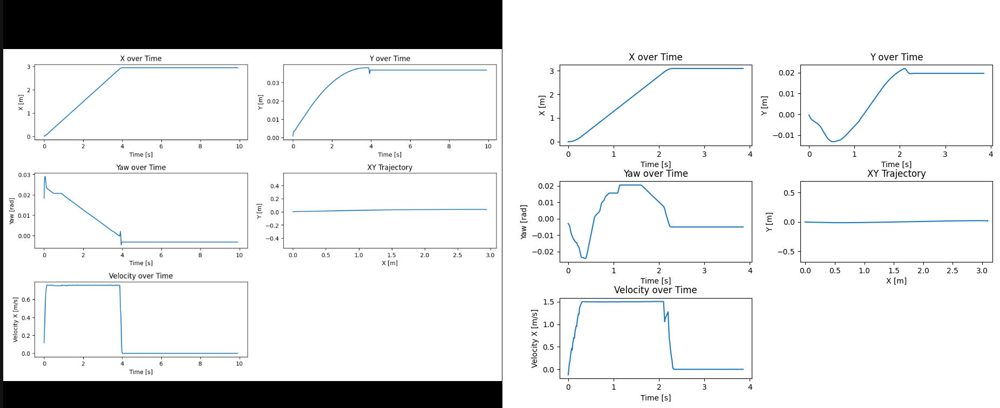

Note:

- Early iterations indicated caps strongly dominated motion behavior.
- Later iterations (after control-path fixes and ROS parameter tuning) demonstrated that removing caps can still yield controllable behavior, with ROS parameters effectively influencing dynamics.

## Sim2Real Alignment Process

### Objective

- Match simulated and real trajectories in position (`x`, `y`) and orientation (`yaw`).
- Reduce KPI errors and move toward `J_tilde <= 1`.

### Method

1. Normalize both datasets into a common reference frame.
2. Resample and compute RMSE/KPI metrics.
3. Tune Isaac and ROS parameters iteratively.
4. Compare overlap plots and aggregate KPI metrics.

### Visualizations

Before parameter adjustment:

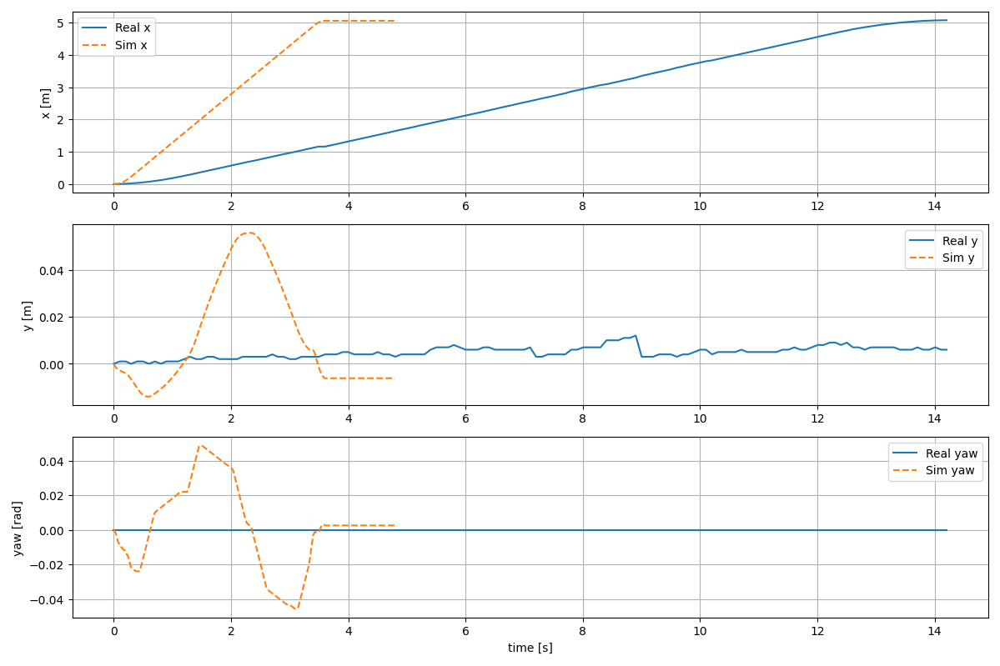

After parameter adjustment:

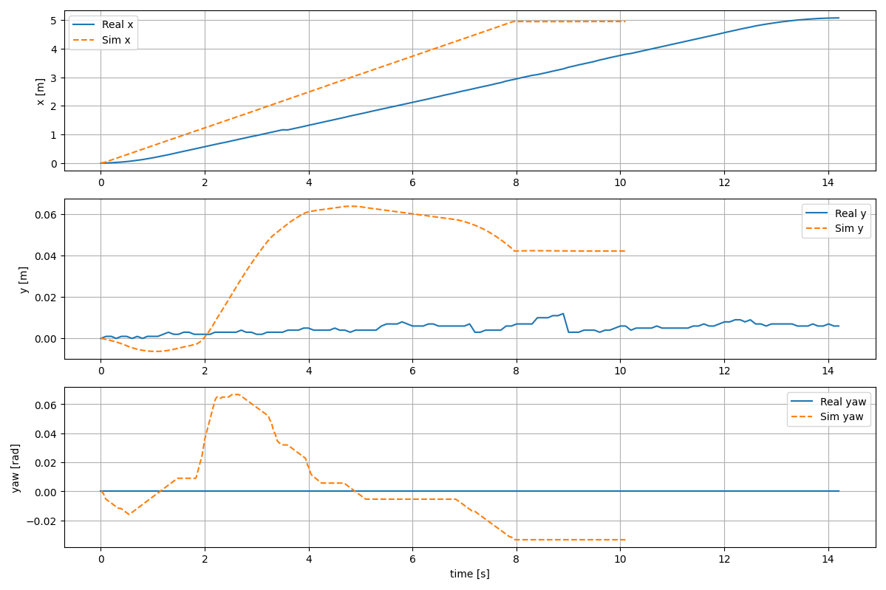

## Iteration Summary

| Iteration | Isaac Max linear speed | Isaac Max ang speed | ROS `max_vel_x` | ROS `max_acc` | `J_tilde` | `RMSE_pos [m]` | `RMSE_psi [rad]` | Time Window |
|---|---:|---:|---:|---:|---:|---:|---:|---|
| 1 | 1.2 | 1.0472 | no effect | no effect | 45.53 | 2.69 | 0.02463 | 0-4.80 s |
| 2 | 1.2 | 1.0472 | no effect | no effect | 13.83 | 2.69 | 0.02463 | 0-4.80 s |
| 3 | 0.5 | 1.0472 | no effect | no effect | 7.07 | 1.33 | 0.02893 | 0-10.10 s |
| 4 | 0.5 | 1.0472 | no effect | no effect | 6.63 | 1.26 | 0.02069 | 0-11.20 s |
| 5 | 0.0 | 0.0000 | 0.2 | 0.2 | 6.13 | 1.18 | 0.01487 | 0-14.20 s |
| 6 | 0.0 | 0.0000 | 0.4 | 0.2 | 2.50 | 0.43 | 0.02258 | 0-12.20 s |
| 7 | 0.0 | 0.0000 | 0.4 | 0.1 | 1.10 | 0.18 | 0.01160 | 0-14.20 s |

Observation:

- During iterations 1-4, ROS parameters had limited effect because Isaac caps dominated the motion envelope.

## Detailed Iterations (5-7)

### Manual check snapshot

```text
J value = 6.63654
[overlap] t in [0.00, 11.20] s
sim Dx=4.857, Dy=0.001, Dyaw=0.033
real Dx=4.232, Dy=0.005, Dyaw=0.000
Samples: 113 @ about 10.0 Hz
RMSE_pos [m] = 1.26803
RMSE_psi [rad] = 0.02069   [deg] = 1.18530
```

Runtime parameter set:

```bash
# Controller Server
ros2 param set /controller_server "FollowPath.max_vel_x" 0.2
ros2 param set /controller_server "FollowPath.max_speed_xy" 0.2
ros2 param set /controller_server "FollowPath.acc_lim_x" 2.0
ros2 param set /controller_server "FollowPath.decel_lim_x" -2.0

# Velocity Smoother
ros2 param set /velocity_smoother max_velocity '[0.2, 0.0, 1.0]'
ros2 param set /velocity_smoother min_velocity '[-0.2, 0.0, -1.0]'
ros2 param set /velocity_smoother max_accel '[2.0, 0.0, 3.2]'
ros2 param set /velocity_smoother max_decel '[-2.0, 0.0, -3.2]'
```

### Iteration 5: Remove DCN cap values

- Inputs:
  - Velocity: `0.2 m/s`
  - Acceleration: `0.4 m/s^2`
- Result:
  - Command velocity and odometry became more consistent.
  - ROS parameters began to shape motion behavior directly.

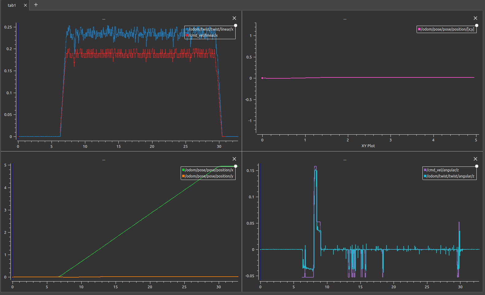
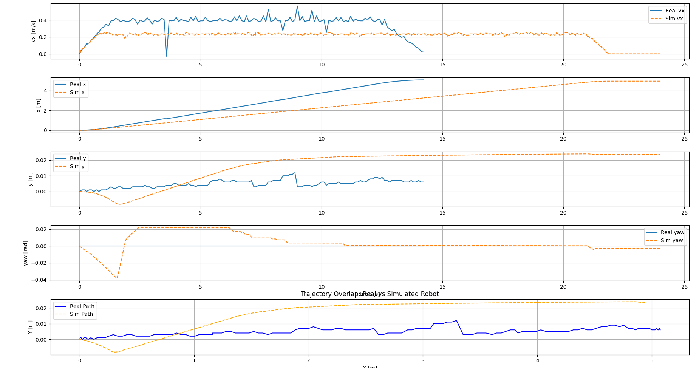

### Iteration 6: Increase ROS velocity toward real robot profile

- Goal:
  - Move closer to observed real velocity (about `0.6 m/s`).
- Result:
  - Better overlap with real trajectory.

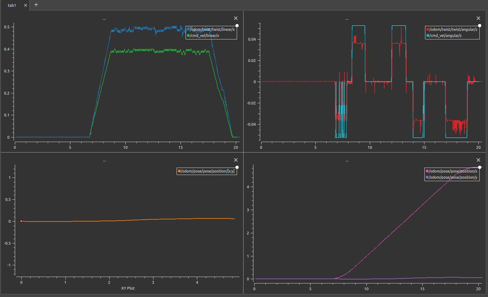
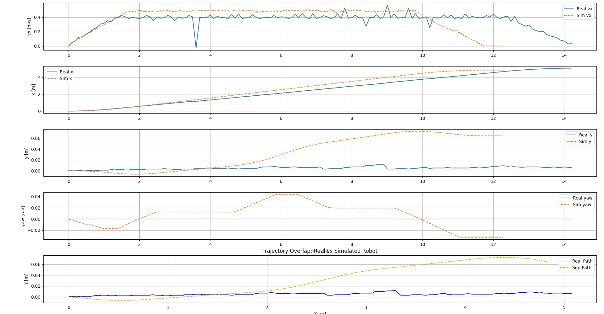

### Iteration 7: Reduce acceleration by 50%

- Inputs:
  - Velocity: `0.4 m/s`
  - Acceleration: `0.1 m/s^2`
- Overlap window:
  - `t in [0.00, 14.20] s`

Results:

- Sim: `Dx = 5.224 m`, `Dy = 0.014 m`, `Dyaw = 0.001 rad`
- Real: `Dx = 5.073 m`, `Dy = 0.006 m`, `Dyaw = 0.000 rad`
- Samples: `143` at about `10.0 Hz`
- `RMSE_pos = 0.18846 m`
- `RMSE_psi = 0.01160 rad` (about 0.6646 deg)
- `J_tilde = 1.10846`

Discussion:

- Lower acceleration increased maneuver time but improved trajectory matching.
- This iteration approached the pass criterion (`J_tilde <= 1.0`).

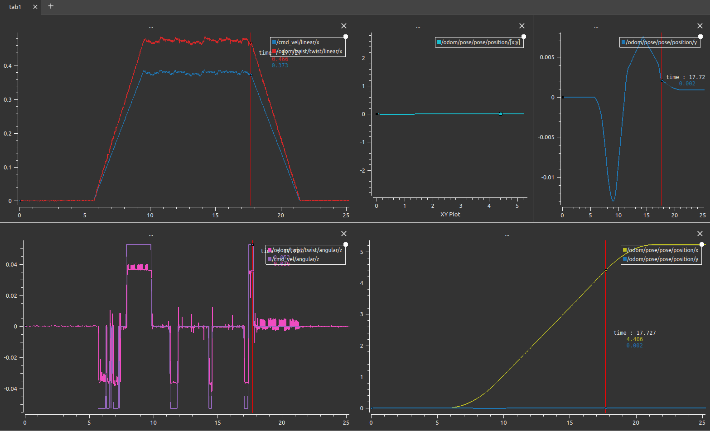
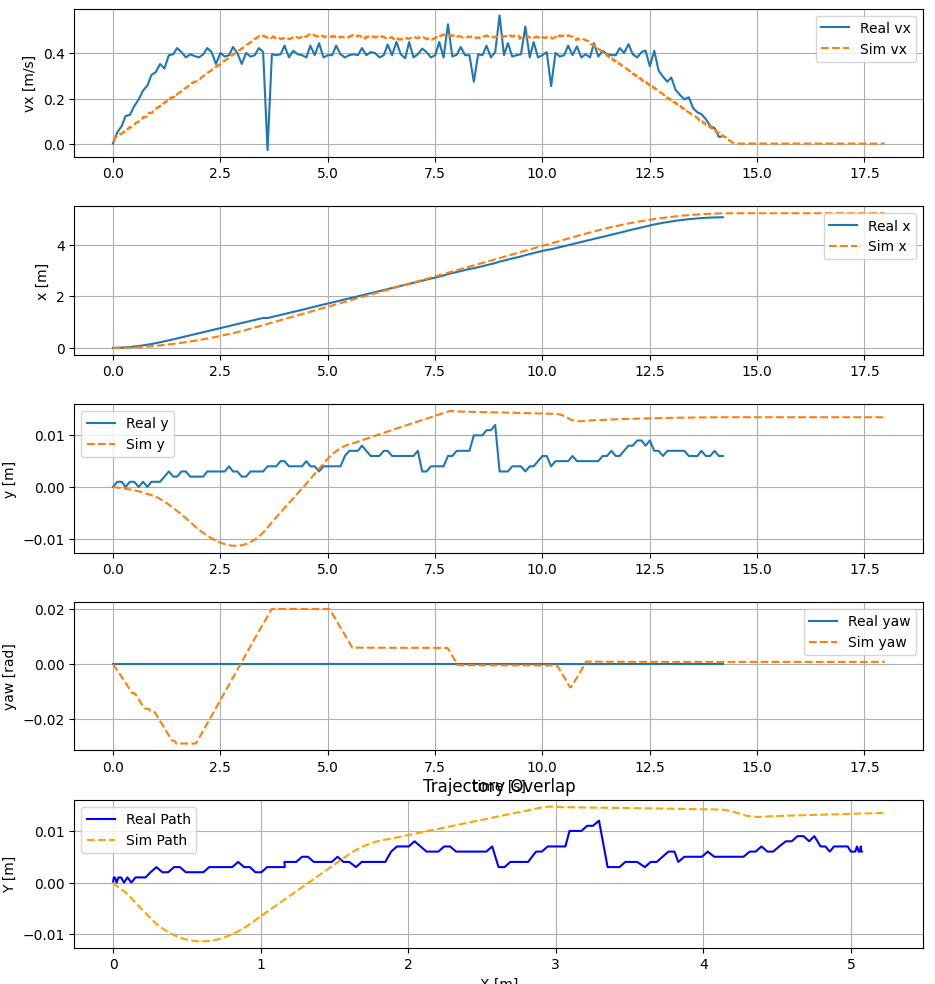

### J progression plot

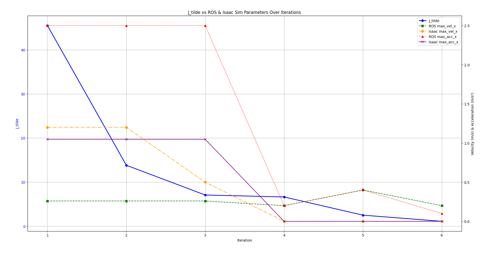

## Conclusion

The Sim2Real workflow is now documented in a reproducible and quantitative way. Key outcomes:

- A stable data pipeline for real and simulated trajectory comparison.
- KPI computation methodology based on synchronized and normalized trajectories.
- Significant reduction in trajectory mismatch through iterative parameter tuning.
- Final tuning stage achieved `J_tilde` close to the pass threshold, indicating strong progress toward robust Sim2Real alignment.
