# Schaeffler AGV Simulation and Navigation

This repository contains an Isaac Sim + ROS 2 Nav2 workflow for AGV simulation, localization, navigation, and Sim2Real parameter tuning.

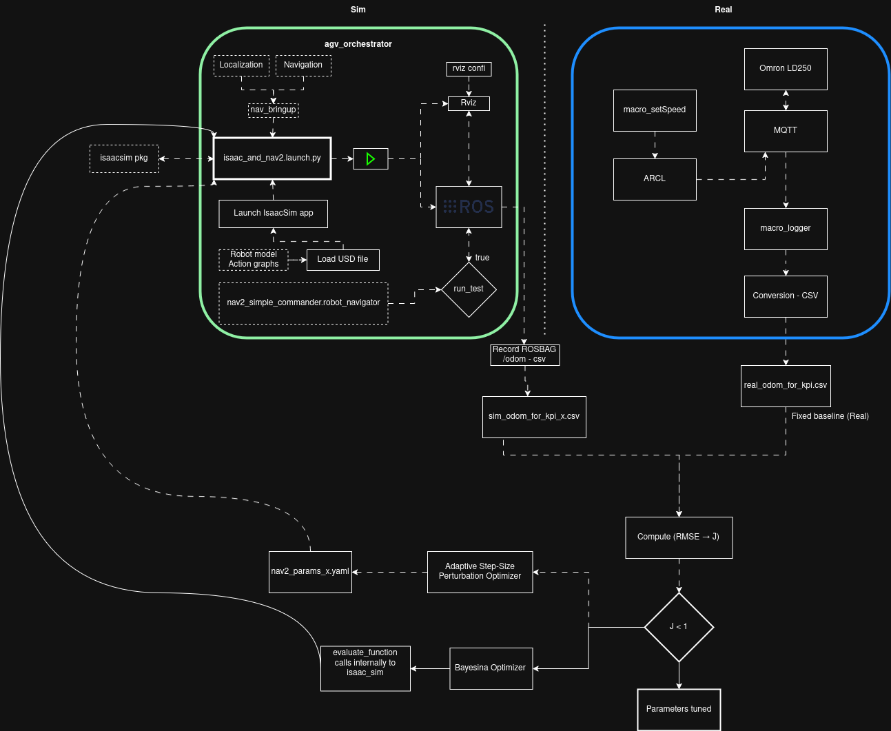

## Table of Contents

- [Schaeffler AGV Simulation and Navigation](#schaeffler-agv-simulation-and-navigation)
  - [Table of Contents](#table-of-contents)
  - [Overview](#overview)
  - [Repository Structure](#repository-structure)
  - [Core Components](#core-components)
  - [Isaac Sim Configuration](#isaac-sim-configuration)
    - [Robot Stage Setup](#robot-stage-setup)
    - [Joint Configuration](#joint-configuration)
    - [Wheel Transform](#wheel-transform)
    - [LiDAR Placement and Orientation](#lidar-placement-and-orientation)
    - [Clock Publisher](#clock-publisher)
    - [Differential Controller](#differential-controller)
    - [ROS Generic Publisher](#ros-generic-publisher)
    - [LiDAR Pipeline](#lidar-pipeline)
    - [ROS Odometry and TF Publication](#ros-odometry-and-tf-publication)
  - [Prerequisites](#prerequisites)
  - [Quick Start](#quick-start)
    - [1) Build and source workspaces](#1-build-and-source-workspaces)
    - [2) Launch Isaac Sim](#2-launch-isaac-sim)
    - [3) Launch Nav2 bringup](#3-launch-nav2-bringup)
    - [4) Open RViz with simulation time](#4-open-rviz-with-simulation-time)
  - [Navigation Workflow](#navigation-workflow)
    - [A) Map creation (SLAM)](#a-map-creation-slam)
    - [B) Localization + Navigation (map-based)](#b-localization--navigation-map-based)
  - [Sim2Real Tuning](#sim2real-tuning)
    - [Manual tuning summary](#manual-tuning-summary)
    - [Bayesian optimization summary](#bayesian-optimization-summary)
    - [Scenario 2 results](#scenario-2-results)
  - [Common Issues and Fixes](#common-issues-and-fixes)
  - [Documentation Index](#documentation-index)
  - [References](#references)

## Overview

The project objective is to align simulated AGV behavior with real robot behavior by:

- Building a reliable Isaac Sim + ROS 2 Nav2 pipeline.
- Running repeatable localization/navigation tests.
- Measuring trajectory error using KPI `J`.
- Tuning motion and controller parameters manually and via Bayesian Optimization.

## Repository Structure

```text
.
├── src/
│   ├── nav_bringup/
│   ├── agv_orchestrator/
│   └── GetSetParams/
├── media/
├── logs/
└── README.md
```

## Core Components

- **`src/nav_bringup`**: Custom Nav2 bringup package with map, config, and launch files.
- **`src/agv_orchestrator`**: Unified launch pipeline for Isaac Sim + Nav2 + optional test/KPI flow.
- **`src/GetSetParams`**: Parameter tuning scripts (`BO.py`, `BO_s2.py`) and plotting utilities.

## Isaac Sim Configuration

This section documents the Isaac Sim stage setup and ROS 2 action graph configuration used in this project.

### Robot Stage Setup

#### Emma Cobot Stage Tree

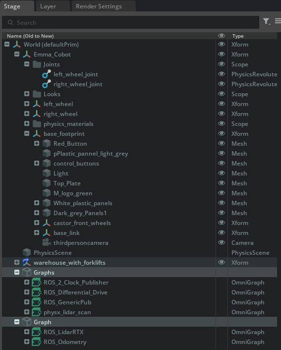

> The articulation root API is assigned to `Emma_cobot`.

### Joint Configuration

Joint mapping in the stage tree:
- `body0` → `base_footprint`
- `body1` → `left_wheel` and `right_wheel`

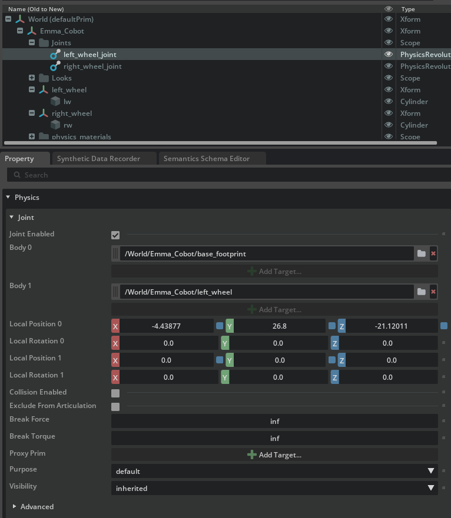

#### Revolute Joint and Angular Drive API

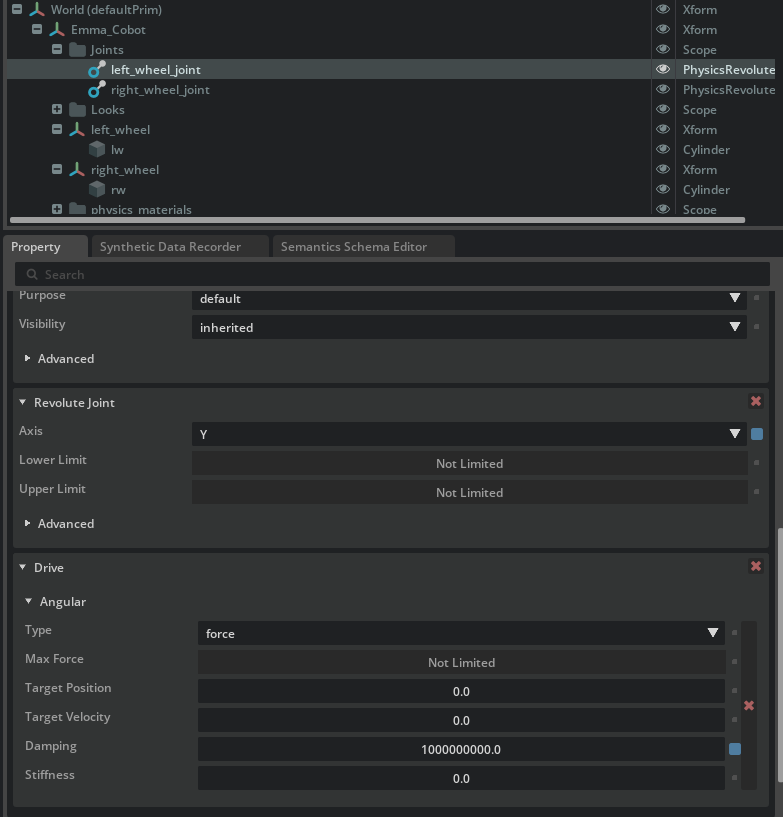

> Current settings: damping = `1e9`, stiffness = `0.0`.

### Wheel Transform

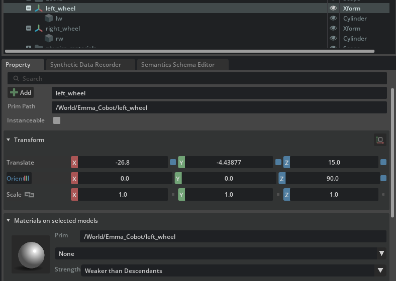

### LiDAR Placement and Orientation

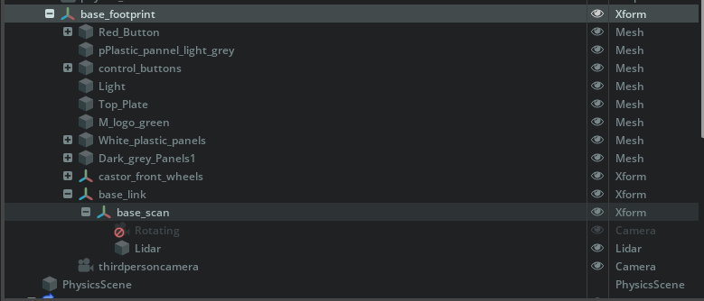

> The LiDAR is placed under the `base_scan` xform.

> All xforms in the stage have rigid body API, and all child nodes of those xforms have collider API.

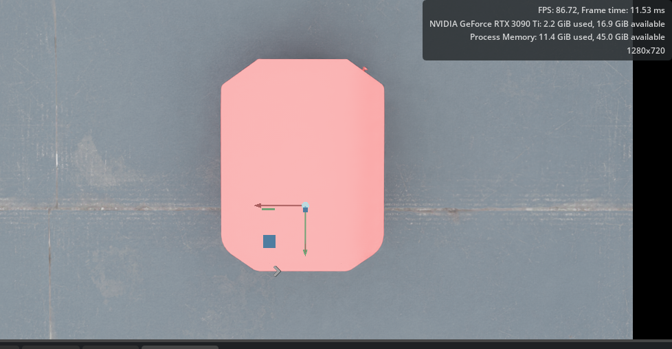

> LiDAR orientation is Y-forward, consistent with xform Y-forward orientation.

> Wheel and body orientations are defined with respect to the global (`W`) frame, with +Y as forward.

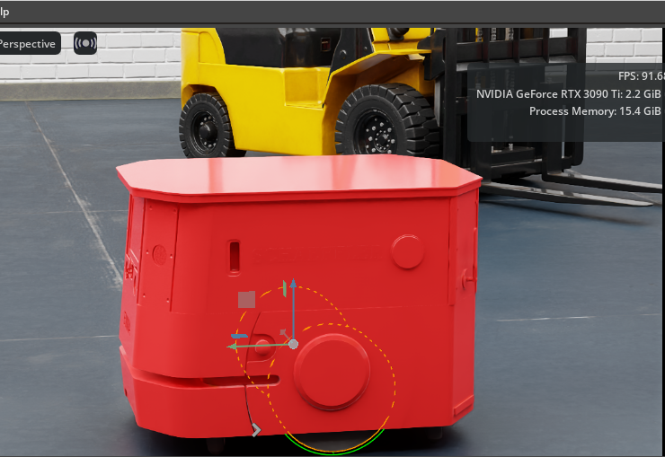

### Clock Publisher

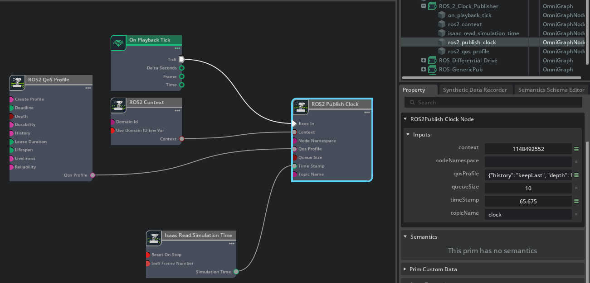

### Differential Controller

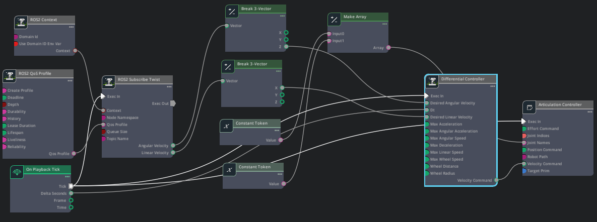

> Velocity and acceleration cap values are intentionally set to zero.

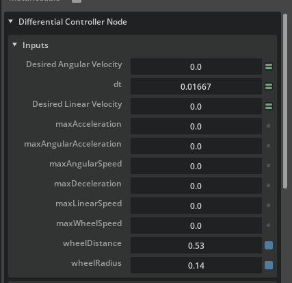

> With this setup, ROS parameters determine robot motion behavior.

### ROS Generic Publisher

Used to monitor simulation publish behavior on the `realtimefactor` topic.

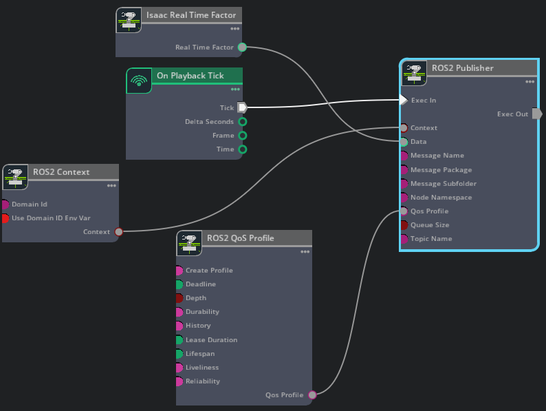

### LiDAR Pipeline

#### Physics LiDAR (active)

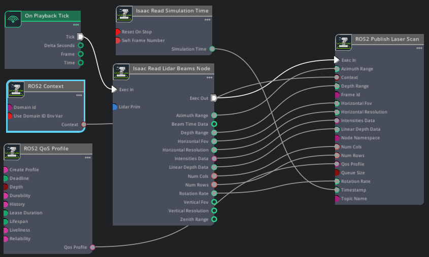

Configured values:
- Horizontal FOV: `270`
- Horizontal resolution: `0.4`
- Rotation rate: `20.0`
- Vertical FOV: `30.0`
- Vertical resolution: `4.0`

Physics LiDAR is used to explicitly configure FOV parameters.

#### RTX LiDAR (reference)

Below is the RTX LiDAR action graph (kept for reference). RTX can publish point clouds, but Physics LiDAR is used for this workflow because only 2D scan points are required.


> The `Isaac Create Render Product` node expects an RTX LiDAR path. In this setup, `Rotating` is intentionally deactivated because Physics LiDAR is active.

### ROS Odometry and TF Publication

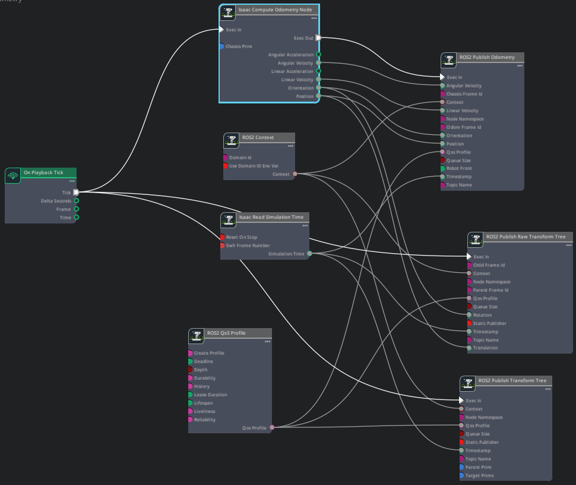

This action graph publishes odometry and transform data for Nav2.

```text
Isaac Compute Odometry Node
chassisPrim: /World/Emma_Cobot
```

```text
ROS2 Publish Odometry Node
ChassisFrameID: base_link
odomFrameID: odom
topicName: /odom
```

```text
ROS2 Publish Raw Transform Tree
childFrameID: base_link
parentFrameID: odom
topicName: /tf
```

```text
ROS2 Publish Transform Tree
parentPrim: /World/Emma_Cobot/base_footprint/base_link

targetPrims:
/World/Emma_Cobot/base_footprint
/World/Emma_Cobot/base_footprint/castor_front_wheels
/World/Emma_Cobot/base_footprint/base_link/base_scan
/World/Emma_Cobot/left_wheel
/World/Emma_Cobot/right_wheel

topicName: /tf
```

## Prerequisites

- Ubuntu/Linux environment
- ROS 2 Humble
- Isaac Sim with ROS 2 bridge
- Built local workspace (`~/schaeffler`)
- Built Isaac Sim ROS workspace (`~/IsaacSim-ros_workspaces/humble_ws`)

## Quick Start

### 1) Build and source workspaces

```bash
source /opt/ros/humble/setup.bash

cd ~/IsaacSim-ros_workspaces/humble_ws
colcon build --symlink-install
source install/setup.bash

cd ~/schaeffler
colcon build
source install/setup.bash
```

### 2) Launch Isaac Sim

```bash
ros2 launch isaacsim run_isaacsim.launch.py \
  gui:="~/Downloads/omron_emma/emma.usd" \
  play_sim_on_start:="true"
```

### 3) Launch Nav2 bringup

```bash
cd ~/schaeffler
source install/setup.bash
ros2 launch nav_bringup bringup_launch.py \
  use_sim_time:=true \
  map:=src/nav_bringup/maps/slam_map.yaml
```

### 4) Open RViz with simulation time

```bash
ros2 run rviz2 rviz2 --ros-args -p use_sim_time:=true
```

## Navigation Workflow

### A) Map creation (SLAM)

1. Run SLAM toolbox:

```bash
ros2 launch slam_toolbox online_async_launch.py use_sim_time:=true
```

2. Drive the robot in simulation and build map coverage.

3. Save map:

```bash
ros2 run nav2_map_server map_saver_cli -f ~/nav2_config/maps/my_map
```

### B) Localization + Navigation (map-based)

1. Launch localization:

```bash
ros2 launch nav2_bringup localization_launch.py \
  map:=/home/schaeffler/nav2_config/maps/my_map.yaml \
  use_sim_time:=true
```

2. Set initial pose in RViz using **2D Pose Estimate**.

3. Launch navigation:

```bash
ros2 launch nav2_bringup bringup_launch.py \
  map:=/home/schaeffler/nav2_config/maps/my_map.yaml \
  use_sim_time:=true \
  params_file:=/home/schaeffler/nav2_config/nav2_params.yaml
```

4. Send goals from RViz using **2D Nav Goal** (or waypoints via script).

## Sim2Real Tuning

### Manual tuning summary

Primary strategy:
- Compare `/cmd_vel` vs `/odom`.
- Measure tracking error (RMSE and KPI `J`).
- Tune physics and Nav2 parameters iteratively.

Observed damping iterations:

| Iteration | Damping | Max Force | RMSE Linear (m/s) | RMSE Angular |
|---|---:|---|---:|---:|
| 1 | 1e9 | unlimited | 0.4447 | 0.7639 |
| 2 | 1e8 | unlimited | 0.4075 | 0.6656 |
| 3 | 1e7 | unlimited | Robot stopped | Robot stopped |

### Bayesian optimization summary

The project uses Bayesian Optimization to minimize KPI `J` by tuning Nav2 parameters.

Run from tuning package:

```bash
cd ~/schaeffler/src/GetSetParams
python3 BO.py
```

Key idea:
- BO proposes parameters within script-defined `pbounds`.
- A full simulation run is launched.
- KPI `J` is read from logs.
- Results are appended to `bo_evals.csv`.
- Optimizer updates and repeats.

Example result snapshot (6 iterations):
- Best `J = 2.250520`
- `max_vel_x = 0.309763`
- `acc_lim_x = 2.715189`

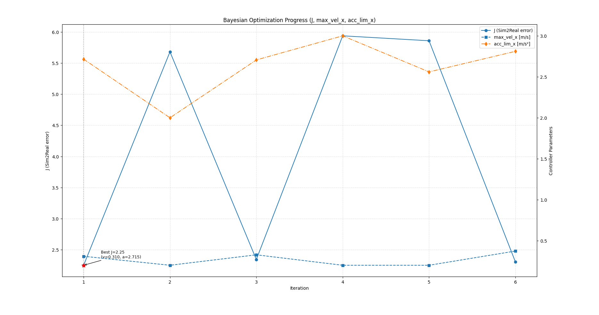
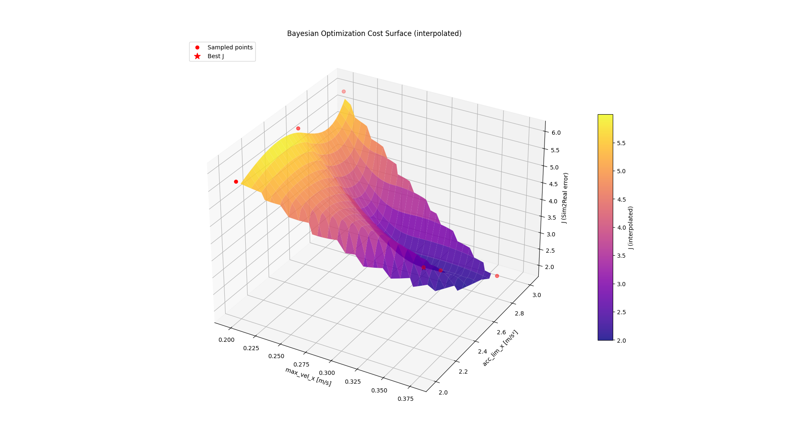

Additional BO visualizations:

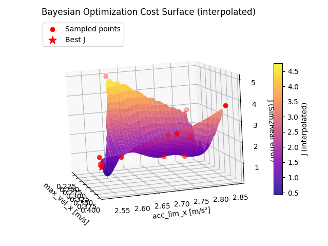

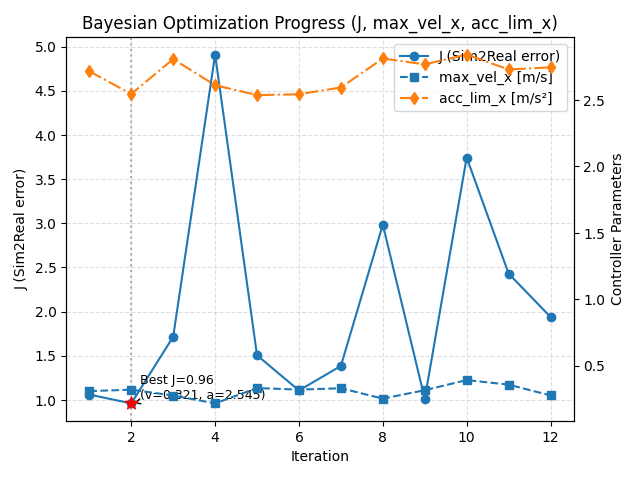

### Scenario 2 results

Scenario 2 extends tuning to linear + angular velocity/acceleration limits.

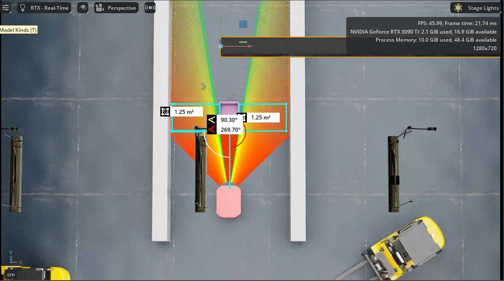

Outcome:
- Reduced trajectory error from `J > 6.0` to approximately `J = 2.517`.
- Improved motion smoothness and reduced oscillatory behavior.

Validation plots:

Before:
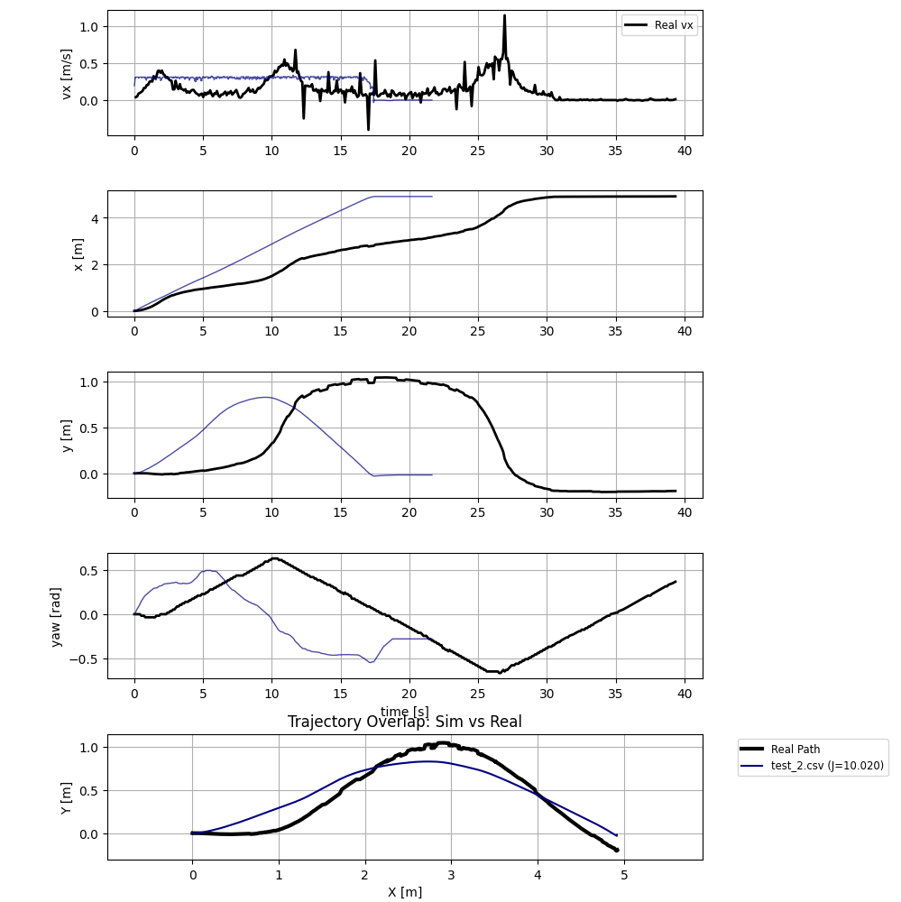

After:
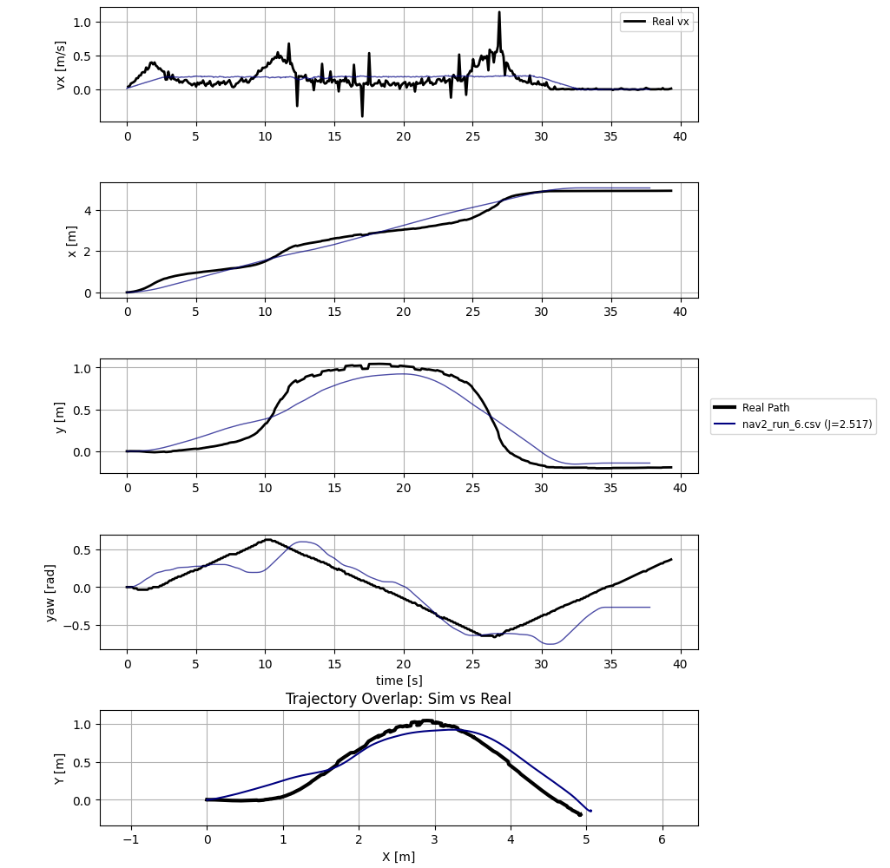

BO overlap and surface:

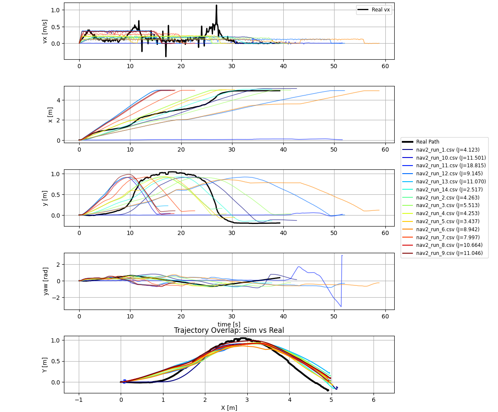
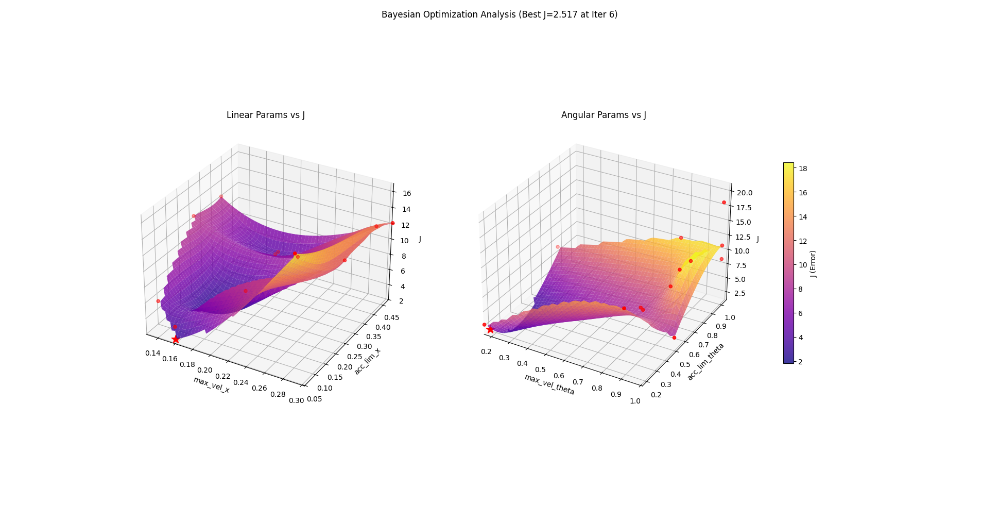

## Common Issues and Fixes

- **RViz time mismatch**
  - Ensure `use_sim_time:=true` is set consistently.

- **Map not visible in RViz**
  - Set map display durability policy to `Transient Local`.

- **Motion appears reversed in RViz**
  - Verify frame orientation consistency with ROS frame conventions.

- **Costmap warning: sensor origin out of bounds**
  - For 2D LiDAR workflows, remove `voxel_layer` and use `obstacle_layer` + `inflation_layer`.

- **Laser frame moving incorrectly with robot**
  - Confirm LiDAR `frame_id` matches the actual xform where LiDAR is mounted.

## Documentation Index

- Isaac Sim configuration and action graph details: [Isaac Sim Configuration](#isaac-sim-configuration)
- Nav2 bringup package guide: [src/nav_bringup/bringup_document.md](src/nav_bringup/bringup_document.md)
- Parameter optimization (Scenario 1 & 2): [src/GetSetParams/README.md](src/GetSetParams/README.md)
- AGV orchestrator launch workflow: [src/agv_orchestrator/README.md](src/agv_orchestrator/README.md)

## References

- [Nav2 Documentation](https://navigation.ros.org/)
- [Isaac Sim ROS 2 Tutorials](https://docs.isaacsim.omniverse.nvidia.com/latest/ros2_tutorials/index.html)
- [Isaac Sim Core API Tutorials](https://docs.isaacsim.omniverse.nvidia.com/latest/core_api_tutorials/index.html#isaac-sim-core-api-tutorials-page)
