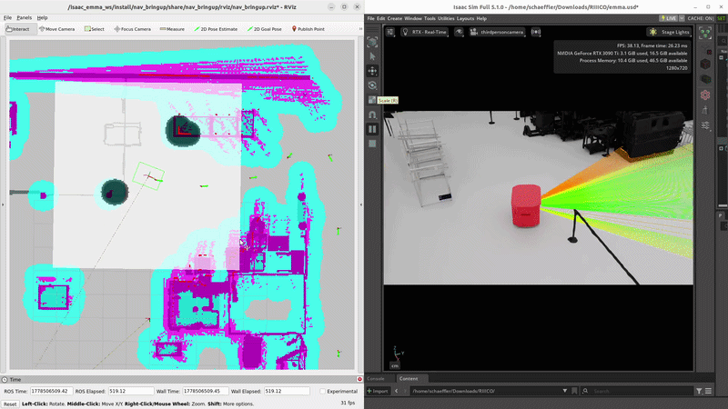

# Docker Setup: ROS 2 Nav2 + Isaac Sim

## Overview

This guide demonstrates the autonomous navigation of the **Emma AGV** within the **Autonomous Production Hub** environment at Schaeffler's F05 building. The robot navigates autonomously using ROS 2 Nav2 stack integrated with NVIDIA Isaac Sim.



---

## Table of Contents
1. [Prerequisites](#prerequisites)
2. [Build Docker Image](#build-docker-image)
3. [Configure Host Environment](#configure-host-environment)
4. [Run Container](#run-container)
5. [Verify Setup](#verify-setup)
6. [Workflow: Launch Nav2 Stack](#workflow-launch-nav2-stack)
7. [Problems Encountered & Solutions](#problems-encountered--solutions) 


## Prerequisites

### System Requirements
- **OS:** Linux (Ubuntu 22.04 LTS recommended)
- **Docker:** Latest version installed
- **ROS 2:** Humble (full desktop installation)
- **Isaac Sim:** Running on host with ROS 2 bridge enabled
- **X11 Display Server:** For GUI forwarding (Linux desktop)
- **Network:** Host and container on same network

### Install Docker
```bash
curl -fsSL https://get.docker.com -o get-docker.sh
sudo sh get-docker.sh
sudo usermod -aG docker $USER
newgrp docker

# Verify installation
docker run hello-world
```

### Install ROS 2 Humble
Follow the official [ROS 2 Humble Installation Guide](https://docs.ros.org/en/humble/Installation.html)

### Clone and Checkout Repository
```bash
git clone https://github.com/engrosamaali91/schaeffler.git
cd schaeffler
git checkout isaac_sim
```

---

## Build Docker Image

### Option A: Build Locally

### Step 1: Build the Image
```bash
docker build -t emma_in_autonomousproductionhub:latest .
```

### Step 2: Verify Build
```bash
docker image ls | grep emma_in_autonomousproductionhub
```

Expected output: Image ID, creation date, and size.

---

### Option B: Pull from Docker Hub (Quick Start)

Skip the build process and pull the pre-built image directly:

```bash
docker pull osamaali91/emma_in_isaacsim:autonomousproductionhub-v2.0.0
```

Verify:
```bash
docker image ls | grep emma_in_isaacsim
```

---

## Configure Host Environment

### Step 1: Set ROS 2 Environment Variables

Open your shell profile (`~/.bashrc` or `~/.zshrc`):
```bash
nano ~/.bashrc
```

Add the following at the end:
```bash
# ROS 2 Humble Setup
source /opt/ros/humble/setup.bash
source ~/schaeffler/install/setup.bash

# ROS 2 Environment Variables
export ROS_DOMAIN_ID=0
export ROS_LOCALHOST_ONLY=0
export RMW_IMPLEMENTATION=rmw_cyclonedds_cpp
export RMW_CYCLONEDDS_URI=file:///etc/cyclonedds.xml
```

### Step 2: Reload Configuration
```bash
source ~/.bashrc
```

### Step 3: Verify Setup
```bash
echo $RMW_IMPLEMENTATION
# Expected output: rmw_cyclonedds_cpp

ros2 topic list
# Should list available topics
```

---

## Run Container

### Prerequisites Before Starting Container
1. **Isaac Sim must be running on the host** with:
   - Emma model loaded
   - Simulation playing (press ▶)
   - ROS 2 bridge active

2. **X11 Display:**
   ```bash
   xhost +local:docker
   ```

### Step 1: Start Container with Correct Environment
```bash
docker run -it --rm \
  --name emma_ros2 \
  --network host \
  --ipc host \
  --pid host \
  -e DISPLAY=$DISPLAY \
  -e ROS_DOMAIN_ID=0 \
  -e ROS_LOCALHOST_ONLY=0 \
  -e RMW_IMPLEMENTATION=rmw_cyclonedds_cpp \
  -v /tmp/.X11-unix:/tmp/.X11-unix:rw \
  emma_in_autonomousproductionhub:latest \
  bash
```

**Or if using Docker Hub image:**
```bash
docker run -it --rm \
  --name emma_ros2 \
  --network host \
  --ipc host \
  --pid host \
  -e DISPLAY=$DISPLAY \
  -e ROS_DOMAIN_ID=0 \
  -e ROS_LOCALHOST_ONLY=0 \
  -e RMW_IMPLEMENTATION=rmw_cyclonedds_cpp \
  -v /tmp/.X11-unix:/tmp/.X11-unix:rw \
  osamaali91/emma_in_isaacsim:autonomousproductionhub-v2.0.0 \
  bash
```

### Step 2: Setup Inside Container
```bash
source install/setup.bash

# Verify environment
export ROS_DOMAIN_ID=0
export ROS_LOCALHOST_ONLY=0
export RMW_IMPLEMENTATION=rmw_cyclonedds_cpp
```

---

## Verify Setup

### Step 1: Check ROS 2 Discovery
Inside container:
```bash
ros2 topic list
```

You should see Isaac Sim topics, such as:
- `/isaac_sim/camera`
- `/isaac_sim/lidar`
- `/tf`

### Step 2: Test Host-Container Communication

**From container, publish test message:**
```bash
ros2 topic pub /docker_test std_msgs/msg/String "data: 'hello from docker'"
```

**From host (new terminal), subscribe:**
```bash
source ~/.bashrc
ros2 topic echo /docker_test
```

**Expected output on host:**
```
data: hello from docker
---
```

If successful, ROS 2 communication is working. Stop the test with `Ctrl+C`.

---

## Workflow: Launch Nav2 Stack

### Terminal 1: Inside Docker Container — Launch Nav2
```bash
cd /isaac_emma_ws
source install/setup.bash

ros2 launch nav_bringup bringup_launch.py \
  use_sim_time:=true \
  map:=src/nav_bringup/maps/riico_right.yaml \
  params_file:=src/nav_bringup/config/nav2_params.yaml
```

Expected output: Nav2 stack launching (Planner, Controller, Recoveries, etc.)

### Terminal 2 (Optional): Launch RViz2 Separately
If RViz2 is not included in the launch file:
```bash
# Get container ID
docker ps

# Open another container shell
docker exec -it <container_id> bash
source install/setup.bash

# Launch RViz2
ros2 run rviz2 rviz2 --ros-args -p use_sim_time:=true
```

### Terminal 3: From Host — Set Navigation Goals
In RViz2:
1. Click **"Nav2 Goal"** tool (top menu)
2. Click on the map to set a goal
3. Nav2 will plan and execute navigation

---

## Problems Encountered & Solutions

### Problem 1: ROS 2 Topics Not Visible Between Host and Container

**Symptoms:**
- `ros2 topic list` on host/container shows different topics
- Topics from one side don't appear on the other

**Diagnosis Performed:**
- ✓ Host ROS 2 communication locally: **working**
- ✓ Docker ↔ Host multicast: **working**
- ✓ ROS 2 topic discovery: **working**
- ✗ ROS 2 message data transfer: **NOT working**

**Root Cause:**
Fast DDS (`rmw_fastrtps_cpp`) successfully discovered topics via multicast but failed to transfer actual message data between host and container. This is a known issue with Fast DDS and Docker host networking.

**Solution Implemented:**
Switched both host and container from Fast DDS to **Cyclone DDS** (`rmw_cyclonedds_cpp`).

**Changes Made:**
1. **Dockerfile:** Added `ros-humble-rmw-cyclonedds-cpp` package
2. **Docker Run:** Added `-e RMW_IMPLEMENTATION=rmw_cyclonedds_cpp`
3. **Host ~/.bashrc:** Added `export RMW_IMPLEMENTATION=rmw_cyclonedds_cpp`

**Result:**
ROS 2 communication between host and container now works reliably.

---

### Problem 2: RViz2 Does Not Display GUI

**Symptoms:**
- RViz2 window doesn't appear on host
- X11 connection refused error

**Solution:**
```bash
xhost +local:docker
```

Run this on the host **before** starting the container. Ensure `$DISPLAY` is set:
```bash
echo $DISPLAY
# Should output something like :0 or :1
```

---

### Problem 3: Container Cannot Access Isaac Sim Topics

**Symptoms:**
- `ros2 topic list` in container returns empty or different topics than host

**Checklist:**
1. **Isaac Sim ROS 2 Bridge:** Verify in Isaac Sim UI that the ROS 2 bridge is active
2. **ROS_DOMAIN_ID Match:** Confirm host and container have same value (default: 0)
3. **Middleware Match:** Both must use Cyclone DDS (`rmw_cyclonedds_cpp`)
4. **Network Mode:** Container must run with `--network host`

**Verify:**
```bash
# On host
printenv | grep ROS_DOMAIN_ID RMW_IMPLEMENTATION

# In container
printenv | grep ROS_DOMAIN_ID RMW_IMPLEMENTATION
```

Both should show:
```
ROS_DOMAIN_ID=0
RMW_IMPLEMENTATION=rmw_cyclonedds_cpp
```

---

### Problem 4: Container ID Not Found

**Symptoms:**
- Error: "No such container" when running `docker exec`

**Solution:**
```bash
# List running containers
docker ps

# Use the correct container name or ID
docker exec -it <container_id_or_name> bash
```

---

### Problem 5: Permission Denied Error on Docker

**Symptoms:**
- `permission denied while trying to connect to Docker daemon`

**Solution:**
```bash
# Add user to docker group (one-time setup)
sudo usermod -aG docker $USER
newgrp docker

# Verify
docker ps
```

---

## Additional Resources

- [Map Creation & Preparation Guide](map.md) — Learn how to create and clean occupancy maps for the Autonomous Production Hub environment