# Isaac sim Configuration


### Emma_cobot stage tree 
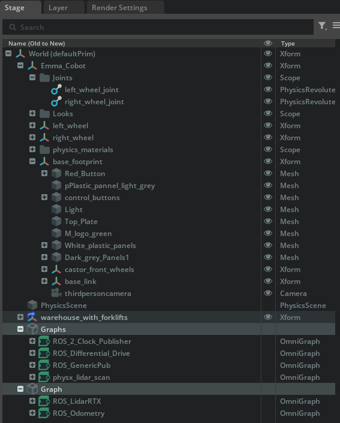


> Assigned articulation root api to Emma_cobot


### Joints
The body0 is base_footprint in the tree and body1 is left_wheel and right_wheel
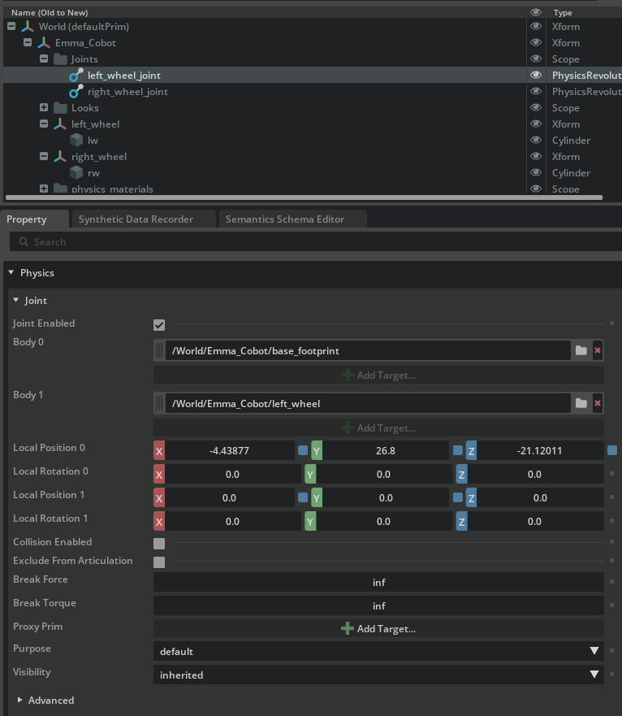


### Revolute Joint and Angular drive api

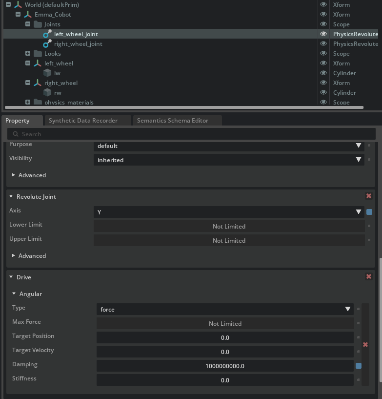

> Note the damping is 1e9 and stiffness is 0.0

### Transform of the wheel

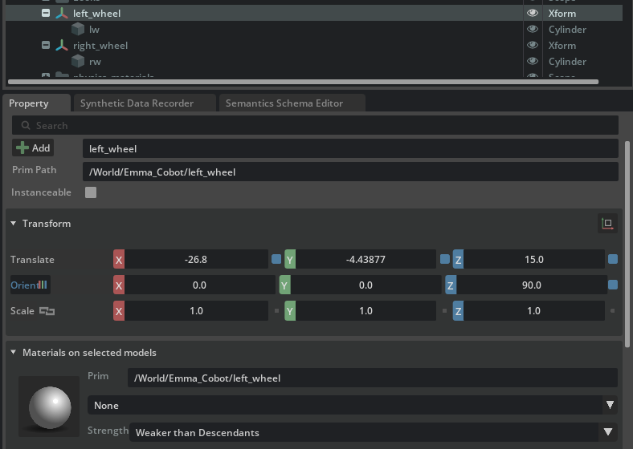


### Lidar placement and orientation in the tree

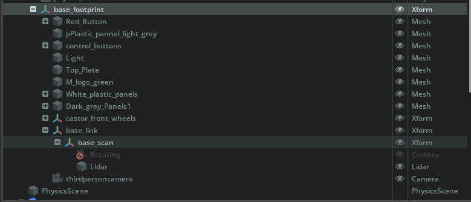

> Lidar is placed under base_scan x_form 

> All the x_form in the stage have rigid body  API and all the child of x_form have collider API

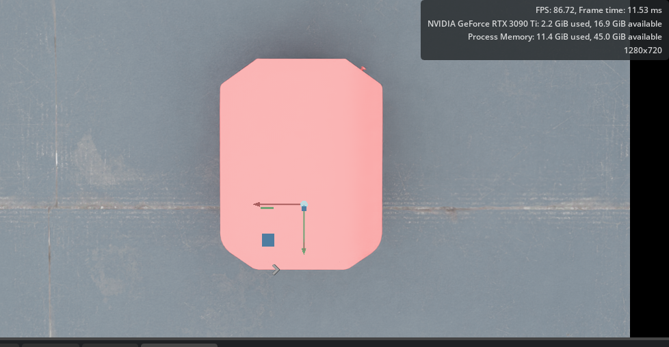

> Lidar orientation is Y forward similar to the x_form Y-forward orientation

> The wheel and body orientation is wrt to gloabl(W) frame i.e. Y pointing forward 

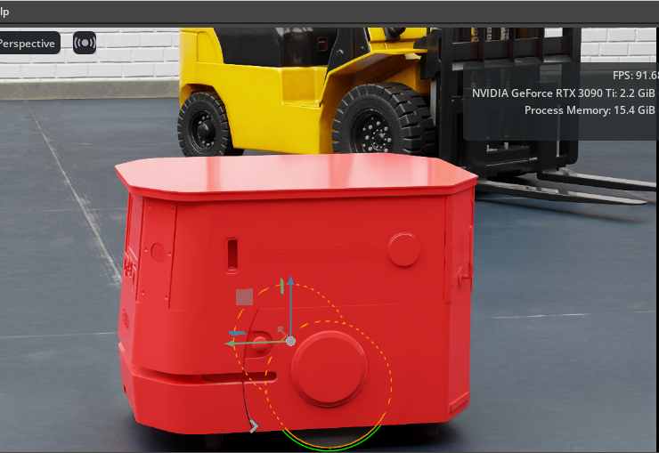

### Clock publisher

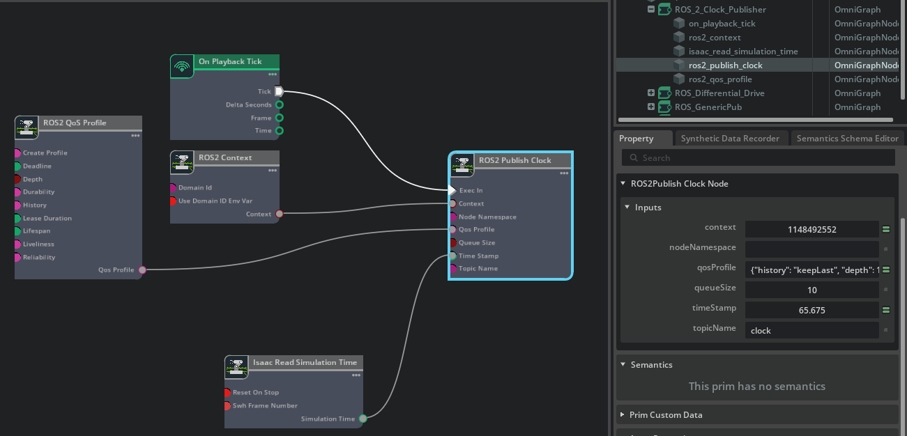


### Differential Controller 

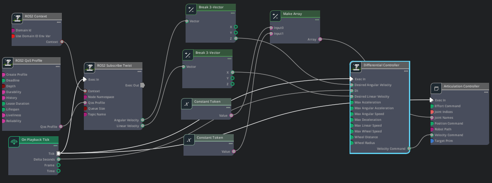

> Note the cap values are deliberately set to zero


> Only ros parameters will have influence on the movement of the robot 

### ROS_Generic Publisher

To check the simulation publishing rate on topic `realtimefactor` 

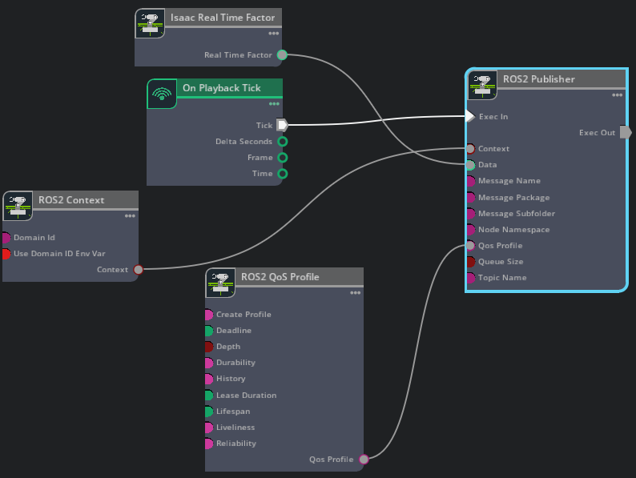

### Physics Lidar scan 

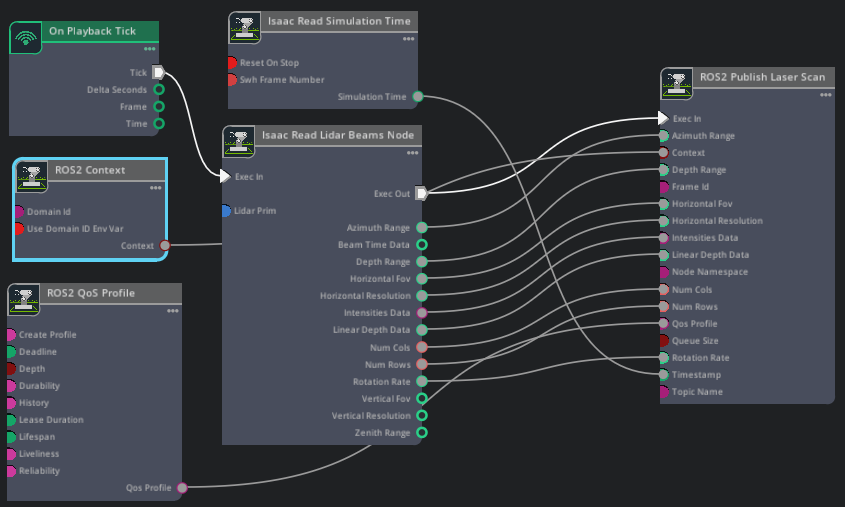

> Horizontal FOV is 270

> Horizontal Resolution 0.4

> Rotation rate 20.0

> Vertical FOV 30.0

> Vertical resolution 4.0

> Note: I used physics lidar instead of RTX lidar to set FOV as the RTX lidar do not have the option to set FOV paramters


Below is the action graph of using RTX lidar, that can also publish point_cloud but for the sake of using only 2d scan points i used physics lidar


> Note Isaac Create render product node expect the path to the RTX lidar. In this case it is deliberately deactivated i.e `Rotating` because physics lidar is being used


### ROS Odometry

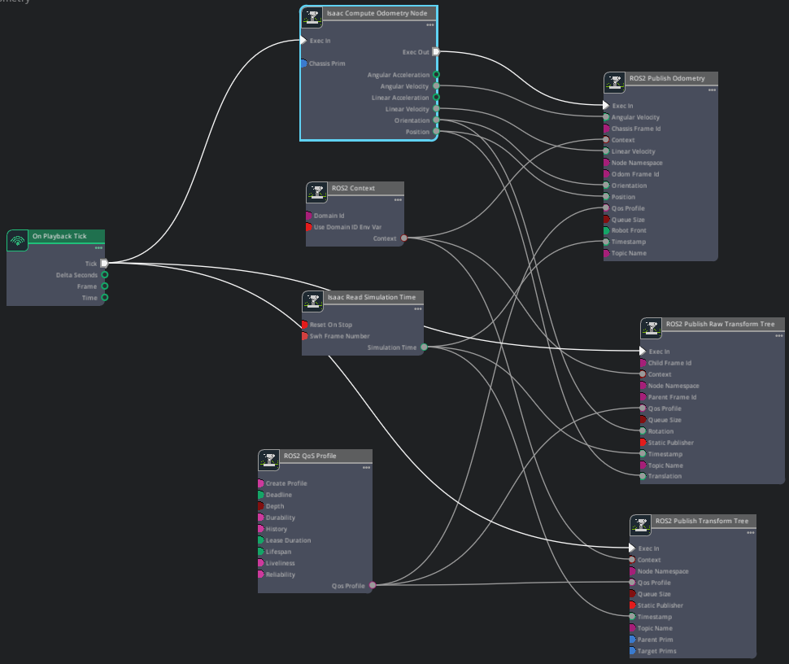

This is one of the most important action graph of the simulation that publishes the odometry and transformations 

```
Isaac Compute Odometry Node expecets chassisPrim path i.e `/World/Emma_Cobot`
```

```
ROS2 Publish Odometry Node:
ChassisFrameID: base_link
odomframeid: odom
topicName: /odom
``` 

```
ROS2 Publish Raw Transform Tree:
childFrameid: base_link
parentFrameid: odom 
topicName: /tf
```

```
ROS2 Publish Transform Tree:
parentPrim: /World/Emma_Cobot/base_footprint/base_link

targetPrims:
/World/Emma_Cobot/base_footprint
/World/Emma_Cobot/base_footprint/castor_front_wheels
/World/Emma_Cobot/base_footprint/base_link/base_scan
/World/Emma_Cobot/left_wheel
/World/Emma_Cobot/right_wheel

topicName: /tf
```

