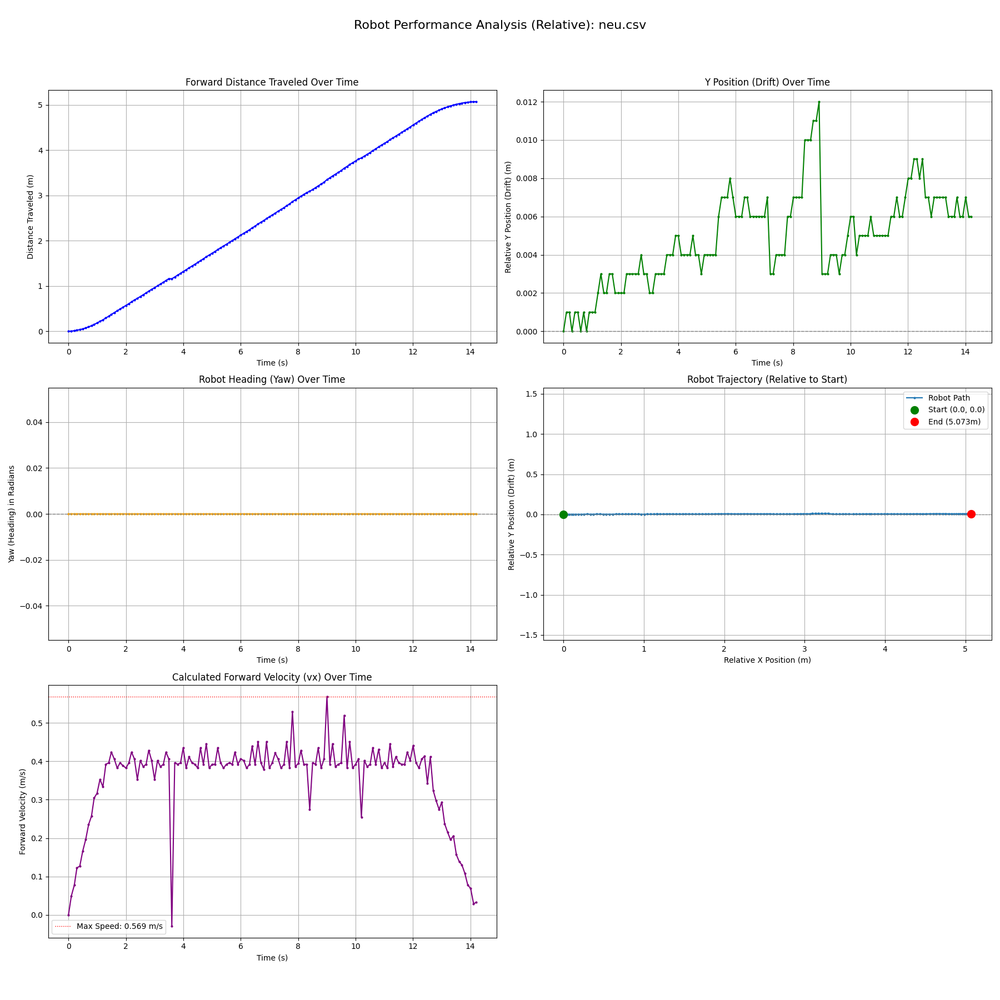
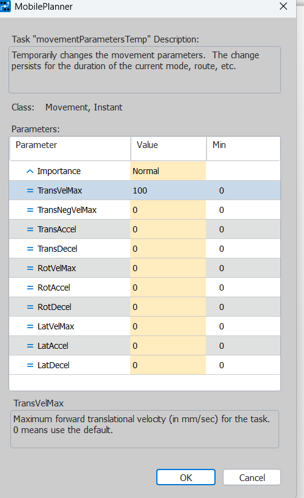
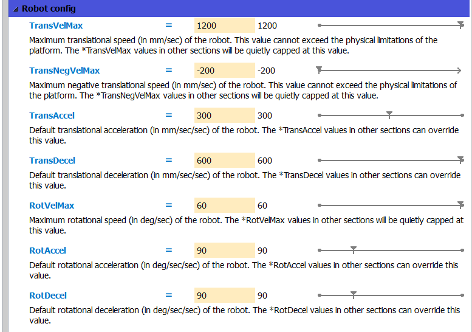

## 📘 Robot Pose Data (LD-250 Real Robot)

This table describes the meaning and units of the fields published by the **Omron LD-250** on the MQTT topic  
`itk/dt/robot/pose`.  
These values represent the robot’s real-world position and orientation, expressed in milli-scaled SI units.

| Field | Description | Default Unit (MQTT message) | SI Equivalent | Conversion Formula |
|--------|--------------|-----------------------------|----------------|--------------------|
| `x` | Robot position along X-axis | **millimeters (mm)** | meters (m) | `x_m = x / 1000` |
| `y` | Robot position along Y-axis | **millimeters (mm)** | meters (m) | `y_m = y / 1000` |
| `th` | Robot orientation (theta / yaw) | **degrees** | radians (rad) | `th_rad = th / 1000` |
| `upd` | Timestamp of pose update | **unix timestamp** | seconds (s) | `t_s = upd / 1000` |

`macro_setSpeeed.py` calls the macro

`macro_logger` logs the data `t x y yaw v_x` after conversions

`plot_robot_csv.py` do the transformation, product a plot as show in image  and final csv file for KPI computation 

# Default configuration of Omron 
The macro is used to temporarily change the speed of the robot for a robot run.
During the data acquisition phase, the robot was moved with different configuration values. The changes were temporarily reflected on the real robot.
For example the robot was moved with 100mm/s speed in a straight line. as shown in the image below:
 

