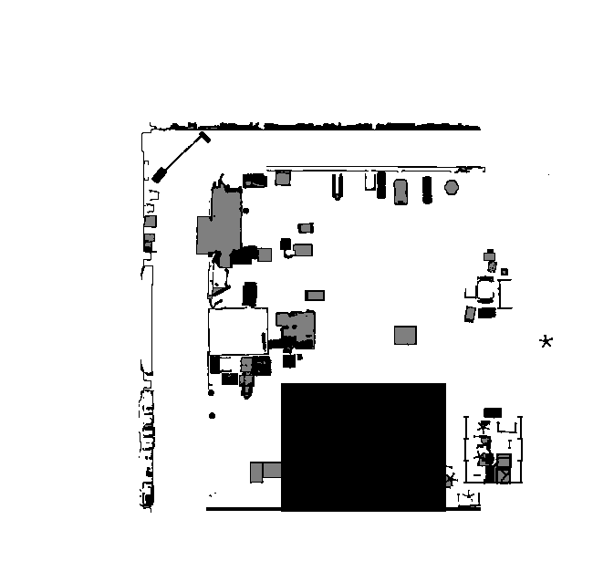
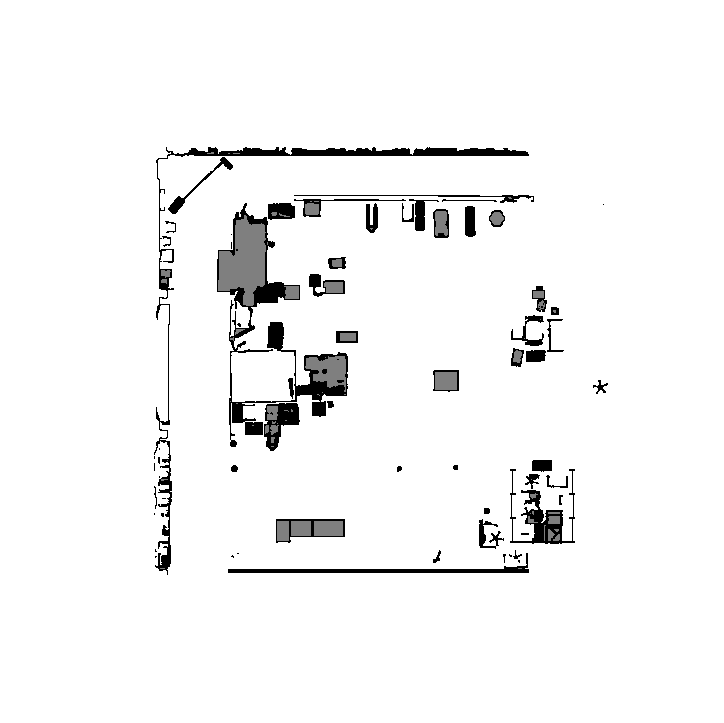
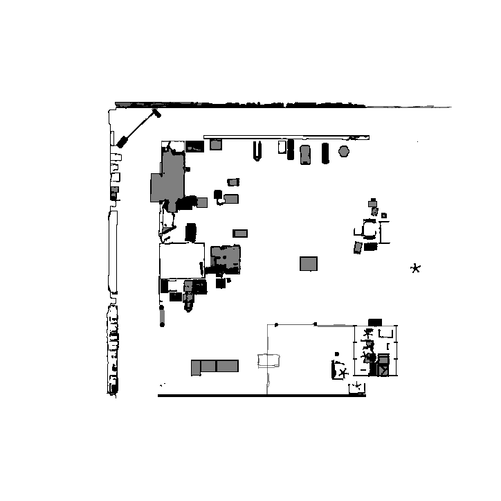

# Creating Occupancy Map of Autonomous Production Hub

## Table of Contents
- [Creating Occupancy Map of Autonomous Production Hub](#creating-occupancy-map-of-autonomous-production-hub)
  - [Table of Contents](#table-of-contents)
  - [Issue](#issue)
  - [Solution](#solution)
  - [Before](#before)
  - [occupancy](#occupancy)

## Issue
Black box artifacts covered the robotic cell area in the occupancy map.

## Solution
```GIMP``` application is used to clean up the map and improve occupancy around the robotic cell.


Refer to 

## Before
<table>
  <tr>
    <th>Before</th>
    <th>After</th>
  </tr>
  <tr>
    <td></td>
    <td></td>
  </tr>
</table>


## occupancy

Autonomous production hub loaded in isaac sim. Occupancy map being visualized in rivz2.


